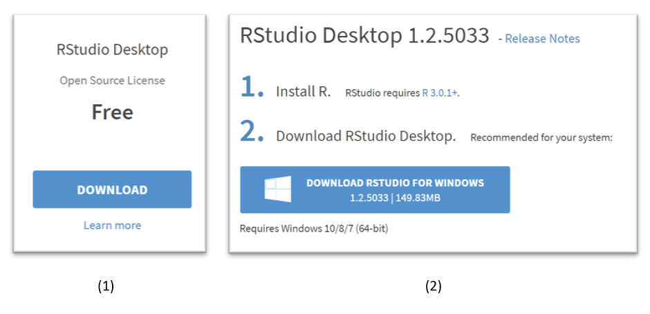
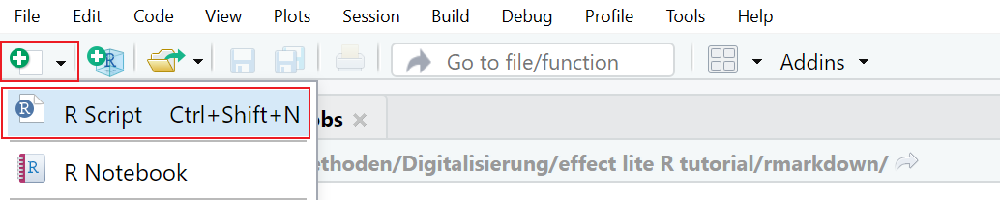
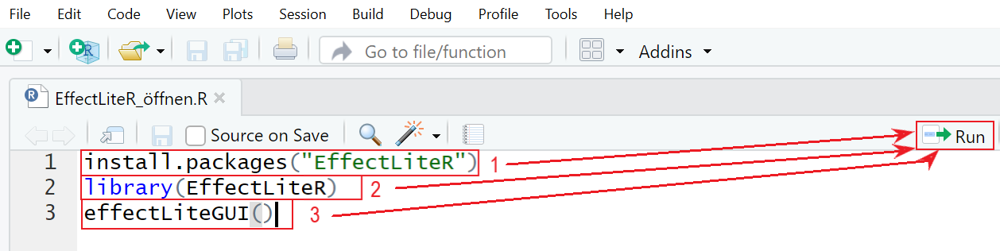
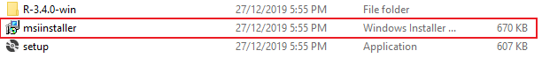

```{r, echo=FALSE, include=FALSE}
library(knitr)
```

# Installation

Die (kostenfreie!) Applikation EffektLiteR kann auf zwei verschiedenen Wegen installiert und genutzt werden:
Zum einen ist es möglich EffektLiteR über die Statistik-Software R zu verwenden (empfohlen), zum anderen ist es für Windows auch möglich EffektLiteR über einen Stand-Alone-Installer zu downloaden. Auch der Stand-Alone-Installer installiert im Hintergrund R.

## Download und Verwendung via R

R ist eine kostenfreie Open-Source-Statistiksoftware. Open Source bedeutet, dass verschiedene Wissenschaftler/Programmierer zusätzliche Pakete schreiben können, mit denen zusätzliche Rechenoperationen auf R ermöglicht werden. EffektLiteR ist ein solches zusätzliches Paket. 
Das Download läuft in drei Schritten ab.

### Schritt 1 – R downloaden

Unter dem Link <https://cran.r-project.org/mirrors.html> findest du verschiedene „Mirrors“ für R, das heißt du findest Links zum Download von R, die von verschiedenen Institutionen bereitgestellt werden. Es wird empfohlen den Link der geographisch am nächsten liegenden Institution zu verwenden.
Klicke auf einen Mirror, Wähle das von dir verwendeten Betriebssystem aus, dann downloade R.

```{r, echo=FALSE, fig.cap="Download von R", out.width = '100%', warning=FALSE, message=FALSE, fig.pos="h"}
include_graphics("images/Download_R.png")
```

Nach Klick auf *install R for the first time* downloadet eine .exe-Datei, die ausgeführt werden muss um R zu installieren. Öffnest du die Datei wirst du durch einen Installer geführt. In den meisten Fällen empfiehlt es sich die 64-Bit-Version von R herunterzuladen und den Haken bei der 32-Bit-Version zu entfernen.  

Wenn du Schwierigkeiten bei der Installation von R hast, schaue dir folgendes Video an:

<video width="320" height="240" controls>
  <source src="screenvideos/Download_R.mp4" type="video/mp4">
  


### Schritt 2 – RStudio downloaden

Mit R hast du das Programm heruntergeladen, das die Rechenoperationen im Hintergrund ausführt, R selbst hat aber keine benutzerfreundliche Oberfläche. Eine Oberfläche, mit der R bedient werden kann, ist RStudio.  
RStudio kann unter dem Link <https://www.rstudio.com/products/rstudio/download/> heruntergeladen werden.
Scrolle etwas herunter und wähle die RStudio-Desktop-Version aus (1), dann klicke auf den Download-Button der Version, die dir passend für dein Betriebssystem vorgeschlagen wird (2).

```{r, echo=FALSE, fig.cap="Download von RStudio", out.width = '100%', warning=FALSE, message=FALSE, fig.pos="h"}

```

Durch den Klick auf *Download RStudio* downloadet eine weitere .exe-Datei, die zur Installation ausgeführt werden muss. Hierbei können alle Voreinstellungen übernommen werden. 

Download von RStudio im Video:

<video width="320" height="240" controls>
  <source src="screenvideos/Download_RStudio.mp4" type="video/mp4">

### Schritt 3 – EffectLiteR installieren und öffnen

Hast du RStudio installiert kannst du damit R bedienen und auf EffectLiteR zugreifen. EffectLiteR ist ein Packet, dass in R installiert, geladen und ausgeführt werden kann. Dafür öffne RStudio, klicke auf das kleine grüne Plus oben links und öffne durch Klick auf *R Script* ein neues R-Dokument, in das du Anweisungen schreiben kannst.

```{r, echo=FALSE, fig.cap="Öffnen eines neuen R-Dokumentes", out.width = '100%', warning=FALSE, message=FALSE, fig.pos="h"}

```  
 
Nun kannst du EffecLiteR installieren, indem du den Befehl *install.packages("EffectLiteR")* ausführst (siehe Figure \@ref(fig:fig1)). Achte darauf, dass die Schreibweise exakt der angegebenen Schreibweise entspricht (du kannst auch auf die Vorschläge klicken, die dir RStudio macht sobald du zu schreiben anfängst). Zum Ausführen des Befehls klicke auf *Run*, während sich der Cursor in der Zeile befindet, die du ausführen möchtest. Wenn du den Befehl korrekt ausgeführt hast, wird das Paket installiert, dies kann einige Zeit dauern. Die Installation ist abgeschlossen, sobald das kleine Stop-Symbol am oberen rechten Rand des unteren Fensters von RStudio verschwunden ist.  
**Nachdem** du das Paket installiert hast lade es, indem du den Befehl *library(EffectLiteR)* ausführst (auf korrekte Schreibweise achten, Cursor in die entsprechende Zeile, *run* klicken), **danach** öffne EffectLiteR durch ausführen von *EffectLiteGUI()*.    
Die beiden unteren Befehle (*library(EffectLiteR)* und *EffectLiteGUI()*) musst du zum Öffnen der Applikation jedes Mal neu ausführen. Speichere die Datei also um EffectLiteR in Zukunft schneller aufrufen zu können.

```{r, fig1, echo=FALSE, fig.cap="EffectLiteR installieren und öffnen", out.width = '100%', warning=FALSE, message=FALSE, fig.pos="h"}

```  


Installation und Öffnen von EffectLiteR im Video:

<video width="320" height="240" controls>
  <source src="screenvideos/Install_Load_EffectLiteR.mp4" type="video/mp4">
  
## Download mit dem Windows-Installer

**Beachte:** Nutze diese Funktion nicht, wenn du R bereits auf deinem PC installiert hast.  

Gelegentlich treten bei der Installation mit dem EffectLiteR-Standalone Installer Fehlermeldungen auf.  

Unter <https://www.metheval.uni-jena.de/projekte/book_causal-effects/tools.php> kann der EffectLiteR-Standalone-Installer heruntergeladen werden.

```{r, echo=FALSE, fig.cap="Download EffectLiteR Stand-Alone-Installer", out.width = '100%', warning=FALSE, message=FALSE, fig.pos="h"}
include_graphics("images/Installation2.1.png")
```

Extrahiere den Zip-Compremierten Ordner und starte den msiinstaller/**oder Setup?**, folge den Anweisungen des Installers
 
```{r, echo=FALSE, fig.cap="Installieren von EffectLiteR mit dem msiinstaller", out.width = '100%', warning=FALSE, message=FALSE, fig.pos="h"}

```
