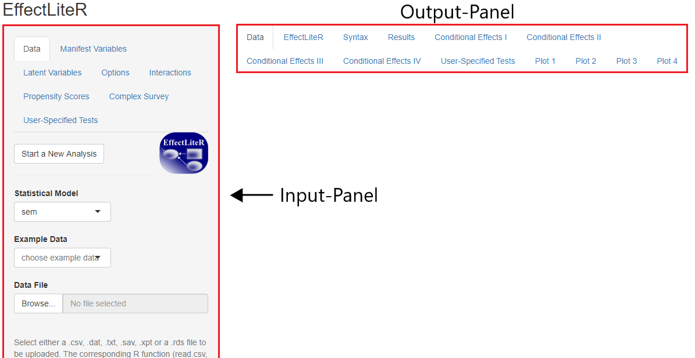

---
output:
  html_document: default
  pdf_document: default
---
```{r, echo=FALSE, include=FALSE}
library(knitr)
```

# Daten einlesen und Schaltflächen {#Einlesen_Schaltflächen}

## Aufbau der graphischen Oberfläche
EffectLiteR hat zwei Panels mit verschiedenen Reitern. Das Input-Panel am linken Rand dient der Spezifikation der Daten und der statistischen Tests, das Output-Panel am oberen Rand erlaubt die Betrachtung verschiedener Outputs. Unter dem Output-Panel werden die gewählten Ergebnisse dann angezeigt.  
  
```{r, echo=FALSE, fig.cap="EffectLiteR Panels", out.width = '100%', warning=FALSE, message=FALSE, fig.pos="h"}

```

Dieses Kapitel widmet sich dem Input-Panel, die relevantesten Reiter des Output-Panels werden im Laufe des Tutorials nach und nach eingeführt, hier nur in Kürze für den besseren Überblick:

* *Data* zeigt die momentan eingelesenen Daten an. 
* *EffectLiteR* zeigt das geschätzte Regressionsmodell sowie die Effektgrößenschätzer an.
* *Syntax* zeigt die lavaan-Syntax an, die im Hintergrund von R berechnet wird (lavvan ist ebenfalls ein R-Paket). 
* *Results* gibt den originalen lavvan-Output aus.
* *Conditional Effects I* zeigt Effektgrößenschätzer für jede Person des Datensatzes an (geschätzt anhand der Kovariaten-Ausprägungen der einzelnen Personen).
* *Conditional Effects II* - *IV* erlauben die Schätzung von Effekten unter selbst spezifizierten Kovariaten-Ausprägungen (CE II wenn die Ausprägungen aller Kovariaten spezifiziert werden sollen, CE III wenn nur einige Kovariaten-Ausprägungen spezifiziert werden sollen, CE IV wenn nur eine einzige Kovariaten-Ausprägung spezifiziert werden soll).
* *User-Specified Tests* werden in diesem Tutorial aktuell nicht behandelt.
* *Plot 1* - *4* zeigen einige informative, interaktive Graphiken zum Datensatz und den 
 


## Daten einlesen
### Beispieldatensätze
EffectLiteR hat verschiedene Beispieldatensätze integriert, an denen Funktionen des Programmes getestet werden können. Die Beispieldatensätze können im Input-Panel unter dem Reiter *Data* durch Klick auf *choose example data* ausgewählt und geladen werden. Ist ein Datensatz geladen beziehen sich auch alle durchgeführten Tests auf diesen Datensatz.
Hast du in der aktuellen Sitzung bereits einen eigene Datensatz geladen kannst du zwar weitere eigene Datensätze, aber keine Beispieldatensätze mehr neu laden. Schließe die Anwendung hierfür und öffne Sie dann erneut.

### Eigene Datensätze
Ebenfalls unter dem Eingabe-Reiter *Data* gibt es die Möglichkeit unter *Data File* eigene Datensätze auszuwählen und zu laden. Folgende Dateitypen werden von EffectLiteR erkannt: .csv, .dat, .txt, .sav, .xpt und .rds.
Excel-Files können (unter *speichern unter*) im .csv-Format gespeichert werden, das .sav-Format wird von SPSS verwendet.

Beachte: Mit EffectLiteR können Datensätze ausgewertet, nicht aber bearbeitet werden. Es ist nicht möglich einzelne Datenpunkte zu ändern oder zu löschen, es ist nicht möglich existente Variablen zu löschen oder neue Variablen zu berechnen. Die Datenaufbereitung sollte also vor der Analyse mit EffectLiteR in einem anderen Programm, z.B. in R, erfolgen. 

Zum Laden eines eigenen Datensatzes durchsuche deinen Computer nach der gewünschten Datei durch einen Klick auf *Browse*.  Wenn du eine Datei ausgewählt hast, sollte EffectLiteR die gewünschten Daten automatisch laden und anzeigen (sofern du im Output-Panel am oberen Rand den Reiter *Data* ausgewählt hast. Wenn die Daten gar nicht angezeigt werden hast du eventuell eine Datei mit einem nicht unterstütztem Dateiformat ausgewählt.
Überprüfe, ob die Daten von EffectLiteR korrekt gelesen werden. Bei fehlerhafter Darstellung  passe die Default-Einstellung unter *Additional Options to Read Data* an.

#### Änderungen der Default-Einstellungen
Zum ändern der Default-Einstellungen scrolle im Input-Panel herunter bis du zu *Additional Options to Read Data* kommst (siehe Figure \@ref(fig:datenfig1)).   

```{r, datenfig1, echo=FALSE, fig.cap="Änderungen der Default-Einstellungen", out.width = '40%', warning=FALSE, message=FALSE, fig.pos="h"}

```
Die verschiedenen Einstellungsmöglichkeiten werden nun eine nach der anderen beschrieben.

##### Use value labels (SPSS Data)
In SPSS können value labels definiert werden (bspw. „male“ für sex = 0 und „female“ für sex = 1). Unter *Use value labels (SPSS Data)* kann definiert werden, ob die value labels oder die Zahlencodes von EffectLiteR angezeigt werden sollen. Wenn du die Option *yes* oder *default* eingestellt hast, kann es vorkommen dass du bei der Berechnung bestimmter Regressionen im Hauptoutput Fehlermeldung wie die folgende erhältst:

```{r, echo=FALSE, fig.cap="Fehlermeldung 'unordered faktor(s): variable name'", out.width = '100%', warning=FALSE, message=FALSE, fig.pos="h"}

```
  
Erhältst du eine solche Fehlermeldung ändere die Einstellung auf *no* und die Berechnung wird möglich. Du kannst zwischen den Einstellungen auch flexibel hin und her wechseln.

##### File contains Variable names (csv, dat and txt data)
Hier gibst du an ob die erste Zeile deines Datensatzes Daten oder Variablennamen enthält. Wenn du hier *yes* auswählst werden die Zellen der erste Zeile des Datensatzes von EffectLiteR als Variablennamen übernommen.

##### Character seperating colums
Hier gibst du an, wodurch die Spalten im Datensatz voneinander abgegrenzt werden. An den dargestellten Beispielen erkennst du, welche Einstellung (*default*, *semicolon* oder *white space*) du bei welcher Art der Spaltentrennung in deiner Daten-Datei wählen solltest. 
```{r, echo=FALSE, fig.cap="Character seperating colums", fig.align='center', out.width = '80%', warning=FALSE, message=FALSE, fig.pos="h"}

```

##### Decimal character
Wähle aus, ob in deinen Dateien Kommas oder Punkte die Abgrenzung zwischen ganzen Zahlen und Nachkommastellen markieren.

##### Missing value code
Hier kannst du, wenn nötig, einstellen, womit in deinem Datensatz fehlende Werte dargestellt werden. Falls beispielsweise „999“ für einen fehlenden Messwert steht, kannst du dies hier eingeben, damit EffectLiteR die Zahl als fehlenden Wert erkennt und ihn bei Berechnungen nicht als Zahlenwert mit einbezieht. Fehlende Werte, die das Programm als solche erkennt, werden von EffectLiteR grundsätzlich mit „NA“ dargestellt.  

## Übungsaufgabe "Dateneinlesen"
Downloade den [Übungsdatensatz 1](../Datensätze/EffectLiteR_Tutorial_Übungsdatensatz1.csv) und lese ihn mit EffectLiteR ein. Der Datensatz entspricht nicht den Default-Einstellungen von EffectLiteR, du musst Änderungen an den *Additional Options to Read Data* vornehmen, insgesamt sind drei Änderungen notwendig, bevor du anfangen könntest Berechnungen am Datensatz vorzunehmen. Führe diese drei Änderungen durch, gehe Schrittweise vor und achte dabei auf Plausibilität der angezeigten Daten.

Lösungen (mit Lösungsvideo) findest du [hier](#lösungen).


