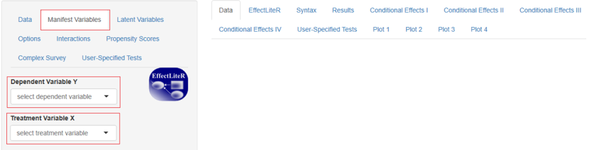
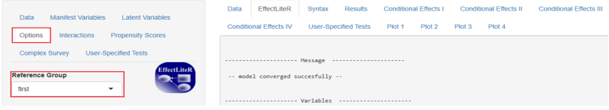
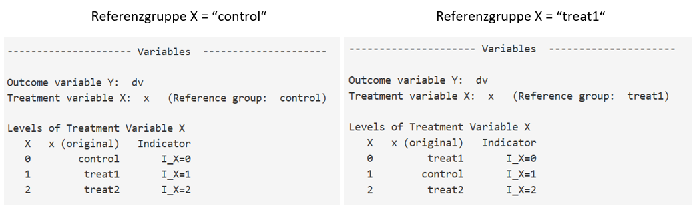
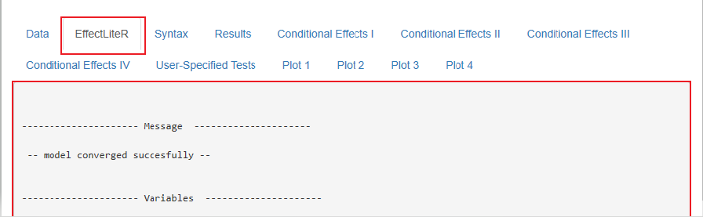
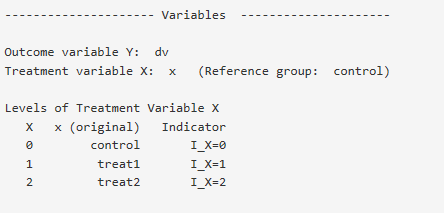
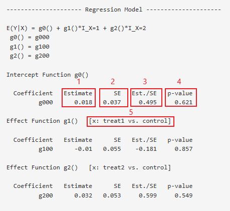
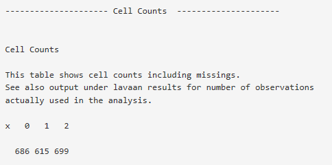
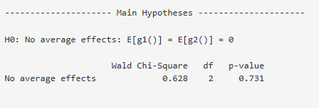
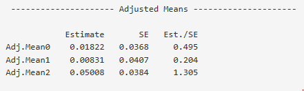
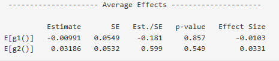

---
output:
  html_document: default
  pdf_document: default
---
```{r, echo=FALSE, include=FALSE}
library(knitr)
```

# Einfache lineare Regression{#eins}

## [Input]{#einsinput}
Die Einfache lineare Regression beschreibt den Zusammenhang einer unabhängigen Variablen (eines Prädiktors bzw. Regressors) mit einer kontinuierlichen abhängigen Variablen, dem Regressanden.
Zur Berechnung einer einfachen linearen Regression in EffektLiteR muss lediglich definiert werden, welche Variable den Regressor und welche den Regressand darstellen soll. 
Wähle dafür unter dem Reiter *Manifest Variables* im Eingabe-Panel als *Dependent Variable Y* den Regressanden und als *Treatment Variable X* den Regressor aus.  

```{r, echo=FALSE, fig.cap="Einfache lineare Regression - Input", out.width = '100%', warning=FALSE, message=FALSE, fig.pos="htbp"}

```
**Beachte:** 
Als Treatment Variable X können nur kategoriale, aber keine kontinuierlichen Variablen ausgewählt werden (sonst erhältst du eine Fehlermeldung im Output-Screen), da das Programm zur analyse (kategorialer) Treatmenteffekte vorgesehen ist. 
Als Abhängige Variable Y können dichotome, ordinale und kontinuierliche Variablen verwendet werden. Die zugrundeliegenden Berechnungsmodelle lassen keine nominalen Variablen mit mehr als 2 Stufen als AV zu.

### Referenzgruppe festlegen {#referenzgruppe-festlegen}
Per Default-Einstellung wird die am niedrigsten kodierte Gruppe (bei mit Worten kodierten Variablen wie *grün*, *rot*,… die nach alphabetischer Reihenfolge erste Gruppe) als Referenzgruppe verwendet. Um die Referenzgruppe zu ändern klicke im Input-Panel auf *Options*, dort kannst du die Referenzgruppe ändern (siehe Figure \@ref(fig:eins2)). Die inhaltlichen Auswirkungen eines Wechsels der Referenzgruppe werden später im Kapitel ([hier](#einsref)) genauer beschrieben.   

```{r, eins2, echo=FALSE, fig.cap="Referenzgruppe - Input", out.width = '100%', warning=FALSE, message=FALSE, fig.pos="htbp"}

```

## Parametrisierung{#einspara}
EffectLiteR schätzt eine Regressionsgleichung mit verschiedenen Parametern. Zu den einzelnen geschätzten Parametern gibt EffectLiteR Statistiken aus, beispielsweise zur Signifikanz der Parameter.
Dementsprechend ist ein Verständnis der von EffectLiteR vorgenommenen Parametrisierung zum Verständnis des Hauptoutputs unabdingbar. Deshalb wird an dieser Stelle eine ausführliche Erläuterung dieser Parametrisierung vorgenommen.  Zuerst am Beispiel einer zweistufigen Treatmentvariablen X, anschließend am Beispiel einer dreistufigen Treatmentvariablen X.

### Zweistufige Treatmentvariable X
EffektLiteR schätzt in diesem Fall folgendes Modell:

\begin{align}
E(Y|X) = g0() + g1() \times I_{X=1}\notag\\
g0() = g_{000}\notag\\
g1() = g_{100}
(\#eq:eins1)
\end{align}

In der oberen Zeile der Gleichungen \@ref(eq:eins1) sehen wir eine Gleichung, auf deren linker Seite ein Erwartungswert, $\small E(Y|X)$, und auf deren rechter Seite zwei miteinander addierte Funktionen, $\small g0()$ und $\small g1()$, stehen. Darunter finden wir eine Definition dieser Funktionen ($\small g0() = g_{000}$ und $\small g1() = g_{100}$). g000 und g100 sind Parameter, die von EffectLiteR geschätzt und auf Signifikanz geprüft werden. Setzt man sie in die oberste Zeile ein erhält man Gleichung \@ref(eq:eins2):

\begin{align}
E(Y|X) = g_{000} + g_{100} \times I_{X=1}
(\#eq:eins2)
\end{align}

EffectLiteR schreibt die Regressionsgleichung in der obersten Zeile der Gleichungen \@ref(eq:eins1) zunächst mit Funktionen und nicht direkt mit den Parametern, da die Terme der Funktionen bei komplexeren Regressionen mit mehreren Kovariaten immer länger werden. Stünden alle Parameter direkt in der oberen Regressionsgleichung würde diese bei komplexeren Regressionen sehr lang und unübersichtlich.  
EffectLiteR schätzt für uns den Wert der Parameter g000 und g100 und gibt beispielsweise an, ob die Parameter signifikant werden. Unser Ziel ist es also zu verstehen was die Parametern g000 und g100 inhaltlich bedeuten, um später interpretieren zu können was genau da signifikant wurde oder auch nicht signifikant wurde. Dafür gehen wir gemeinsam durch die einzelnen Komponenten der Gleichung \@ref(eq:eins2). Um die inhaltliche Interpretation zu erleichtern führen wir vorher ein Beispiel ein.

**Beispiel 1**  
*Ein Teil der Patienten einer Einrichtung erhält eine Behandlung, während ein anderer Teil keine Behandlung erhält. Es wird erhoben, wie es den Behandelten zu einem fixen Zeitpunkt einige Wochen nach Behandlungsbeginn der behandelten Gruppe gesundheitlich geht.*  
*Abhängige Variable Y : Gesundheitsscore von Patienten.*  
*Treatmentvariable X: Erhalten Patienten eine Behandlung (X=1) oder erhalten sie keine Behandlung (X=0).*  

Auf der linken Seite der Gleichung \@ref(eq:eins2) finden wir den Ausdruck $\small E(Y|X)$. $\small E(Y|X)$ gibt an, dass wir einen Erwartungswert berechnen, den Erwartungswert der Variable $\small Y$ in Abhängigkeit von $\small X$. Bezogen auf unser Beispiel: Wir berechnen den erwarteten Gesundheitsscore unter den verschiedenen Treatmentbedingungen. Der Erwartungswert unter der Bedingung $\small X=0$ ($\small E(Y|X=0)$) kann vom Erwartungswert unter der Bedingung $\small X=0$ ($\small E(Y|X=0)$) abweichen.
In unserem Beispiel entspräche ($\small E(Y|X=0)$) dem erwarteten Gesundheisscore von Patienten, die keine Behandlung erhalten, während ($\small E(Y|X=1)$) dem erwarteten Gesundheisscore von Patienten entspricht, die eine Behandlung erhalten.  

Auf der rechten Seite von Gleichung \@ref(eq:eins2) finden wir zwei Parameter, nämlich g000 und g100, sowie eine Indikatorvariable, nämlich ($\small I_{X=1}$. Eine Indikatorvariable nimmt den Wert Eins an, wenn ihre Bedingung (in diesem Fall ($\small X=1$) erfüllt ist, in jedem anderen Fall nimmt sie den Wert Null an. 

**Beachte**  
Für den Fall, dass die Treatmentvarible nicht mit den Zahlen $\small 0$ und $\small 1$ kodiert ist (sondern etwa mit $\small 1$ und $\small 2$ oder mit $\small KG$ und $\small EG$), wird den verschiedenen Ausprägungen der Treatmentvariable dennoch ein „Variablenlevel“ zugeordnet, dass bei null startet und dann in ganzen Zahlen steigt. So wird $\small KG$ evtl. dem Variablenlevel $\small 0$ zugeordnet und $\small EG$ dem Variablenlevel $\small 1$. Diese Zuordnung eines Variablenlevels kann man als Umkodierung der Treatmentvariable verstehen. Unter [*Cell Counts*](#einscellcount) im Hauptoutput kann nachgesehen werden, welcher Variablenausprägung welches Variablenlevel zugeordnet wird. 

#### Parameter g000
Berechnen wir den Erwartungswert von einem Fall, in dem X den Wert null annimmt, lautet die entsprechende Gleichung:

\begin{align}
E(Y|X=0) = g_{000} + g_{100} \times 0
(\#eq:eins3)
\end{align}
**Bemerke:** Die Bedingung der Indikatorvariable $\small I_{X=1}$ ist nicht gegeben, wir Betrachten schließlich den Erwartungswert unter der Bedingung $\small X=0$, deshalb nimmt die Indikatorvariable den Wert Null an.

Dies bedeutet: Unter der Bedingung $\small X=0$ ist der Parameter g000 gleich dem Erwartungswert von $\small Y$ unter der Bedingung $\small X=0$ bzw. $\small E(Y|X=0) = g_{000}$. 
EffectLiteR nutzt also den durchschnittlichen Wert der abhängigen Variable all jener Fälle, die der Bedingung $\small X=0$ entsprechen, um den Parameter g000 zu schätzen.  
In unserem Beispiel gäbe uns der Parameter g000 also den erwarteten $\small Y$-Wert (Gesundheitsscore) für Patienten, die keine Behandlung erhielten.

#### Parameter g100
Berechnen wir den Erwartungswert von einem Fall in dem $\small X$ den Wert eins annimmt, so lautet die entsprechende Regressionsgleichung:

\begin{align}
E(Y|X=1) = g_{000} + g_{100} \times 1
(\#eq:eins4)
\end{align}
**Bemerke:** Die Bedingung der Indikatorvariable $\small I_{X=1}$ ist  gegeben, deshalb nimmt sie den Wert eins an.  

EffectLiteR nutzt also den Parameter g000 und alle Fälle, die der Bedingung $\small X=1$ entsprechen, um den Parameter g100 zu schätzen.
Oben (Gleichung \@ref(eq:eins3)) haben wir gezeigt, dass der Parameter g000 den Erwartungswert von $\small Y$ unter der Bedingung $\small X=0$, also $\small E(Y|X=0)$, darstellt. Setzen wir diesen Erwartungswert für g000 in die Regressionsgleichung oben (Gleichung \@ref(eq:eins4)) ein, so ergibt sich folgender Ausdruck:

\begin{align}
E(Y|X=1) &= E(Y|X=0) + g100 \times 1 \notag\\
g_{100} &= E(Y|X=1) - E(Y|X=0)
(\#eq:eins5)
\end{align}

Der Erwartungswert $\small E(Y|X=1)$ ist um den Parameter g100 größer als der Erwartungswert $\small E(Y|X=0)$ (Gleichungen \@ref(eq:eins5), obere Zeile). Der Parameter g100 gibt also den Unterschied zwischen dem Erwartungswert von $\small Y$ unter der Bedingung $\small X=0$ und dem Erwartungswert von $\small Y$ unter der Bedingung $\small X=1$ an (Gleichungen \@ref(eq:eins5), untere Zeile). g100 gibt somit den geschätzten Effekt von $\small X$ auf $\small Y$ an: wird $\small X$ um eins größer, so wird der Erwartungswert von $\small Y$ um g100 größer.   
Wird der Parameter g100 signifikant heißt dies, dass es in der abhängigen Variable einen signifikanten Unterschied zwischen Fällen mit $\small X=0$ und $\small X=1$ gibt. Wird g100, so gibt es einen signifikanten Treatmenteffekt.

In unserem Beispiel gibt uns der Parameter g100 also die Erwartete Differenz zwischen dem Gesundheitsscore von Patienten die eine Behandlung erhielten und von Patienten, die keine Behandlung erhielten. Wird der Parameter g100 im EffectLite-Hauptoutput signifikant, bedeutet das in diesem Beispiel, dass die Behandlung einen signifikanten Effekt auf den Gesundheitsscore der Patienten hat. (Kausalität kann natürlich nur angenommen werden, wenn eine randomisierte Zuweisung von Patienten zu den Gruppen Behandlung / keine Behandlung vorgenommen wurde, ansonsten muss von einem korrelativen Zusammenhang gesprochen werden).
Um zu erkennen in welche Richtung der Effekt geht (haben Patienten mit oder ohne Behandlung einen höheren Gesundheitsscore) betrachten wir die (umgestellte) obere Zeile der Gleichungen \@ref(eq:eins5):

\begin{align}
E(Y|X=1)-g_{100} = E(Y|X=0)
(\#eq:label6)
\end{align}

Wir sehen: $\small E(Y|X=1)$ ist um den Parameter g100 größer als $\small E(Y|X=0)$. Daraus schließen wir:   
Falls g100 positiv ist gilt:  $\small E(Y|X=1) > E(Y|X=0)$   
Falls g100 negativ ist gilt:  $\small E(Y|X=1) < E(Y|X=0)$

### Dreistufige Treatmentvariable X

Hat die Treatmentvariable $\small X$ eine Stufe mehr, so wird für diese Stufe eine weitere Funktion, $\small g2()$, multipliziert mit einer weiteren Indikatorvariablen, $\small I_{X=2}$, zum bisherigen Regressionsterm (Gleichung \@ref(eq:eins2)) hinzuaddiert. Auch die $\small g2()$-Funktion besteht nur aus einem Parameter. Folgendes Regressionsmodel wird von EffectLiteR geschätzt:
 

\begin{align}
E(Y|X) &= g0() + g1() \times I_{X=1} + g1() \times I_{X=1}\notag\\
g0() &= g_{000}\notag\\
g1() &= g_{100}\notag\\
g2() &= g_{200}
(\#eq:label7)
\end{align}

Auch hier wollen wir die drei Parameter g000, g100 und g200 wieder anhand eines Beispiels inhaltlich verstehen:

[**Beispiel 2**]{bspzwei}   
*Stellen wir uns vor, der Effekt zweier unterschiedlicher Behandlungen soll analysiert werden.*  
*Abhängige Variable* $\small Y$*: Gesundheitsscore von Patienten.*  
*Treatmentvariable* $\small X$*: Erhalten Patienten Behandlung Typ 1 (*$\small X=1$*), erhalten sie Behandlung Typ 2 (*$\small X=2$*)  oder erhalten sie keine Behandlung (*$\small X=0$*).*   

Unser Vorgehen ist das selbe, wie im Beispiel 1 oben: Wir probieren die Parameter mit Erwartungswerten von $\small Y$ bzw. mit Differenzen zwischen Erwartungswerten von $\small Y$ auszudrücken. Dafür setzen wir zuerst die Parameter in das geschätzte Regressionsmodell ein:

\begin{align}
E(Y|X) &= g_{000} + g_{100} \times I_{X=1}+ g_{200} \times I_{X=2} 
(\#eq:eins8)
\end{align}

#### Parameter g000
Unter der Bedingung $\small X=0$ nehmen beide Indikatorvariablen oben den Wert Null an und wir können den Parameter g000 interpretieren:

\begin{align}
E(Y|X=0) &= g_{000} + g_{100} \times 0 + g_{200} \times 0 \notag\\
E(Y|X=0) &= g_{000}
(\#eq:label9)
\end{align}

**Bemerke:** Weder die Bedingung der Indikatorvariable $\small I_{X=1}$, noch die Bedingung der Indikatorvariable $\small I_{X=2}$ sind gegeben. Desshalb nehmen beide Indikatorvariablen den Wert Null an.  

Der Parameter g000 stellt also den Erwartungswert von $\small Y$ unter der Bedingung $\small X=0$ dar. In unserem Beispiel: g000 schätzt den Gesundheitsscore von Patienten ohne Behandlung.

#### Parameter g100
Der Parameter g100 fällt in der Bedingung $\small X=1$ NICHT weg, betrachten wir also diesen Fall, um den Parameter g100 interpretieren zu können:

\begin{align}
E(Y|X=1) = g_{000} + g_{100} \times 1 + g_{200} \times 0
(\#eq:label10)
\end{align}

**Bemerke:** Die Bedingung der Indikatorvariable $\small I_{X=1}$ ist gegeben, sie nimmt den Wert Eins an, die Bedingung der Indikatorvariable $\small I_{X=2}$ ist nicht gegeben, sie nimmt den Wert Null an.  

Wie bereits im Beispiel mit der zweistufigen Treatmentvariablen können wir den bedingten Erwartungswert $\small E(Y|X=0)$ für g000 einsetzen und somit dem Parameter g100 inhaltlichen Sinn verleihen:

\begin{align}
E(Y|X=1) &= E(Y|X=0) + g_{100} \times 1 + g_{200} \times 0 \notag\\
g_{100} &= E(Y|X=1) - E(Y|X=0)
(\#eq:label11)
\end{align}

Der Parameter g100 gibt also wieder den Unterschied zwischen dem Erwartungswert von $\small Y$ unter der Bedingung $\small X=0$ und dem Erwartungswert von $\small Y$ unter der Bedingung $\small X=1$ an (untere Zeile). g100 gibt somit den geschätzten Effekt einer Veränderung von $\small X=0$ zu $\small X=1$ X auf die abhängige Variable $\small Y$ an: Ändert sich $\small X$ von null auf eins, so wird der Erwartungswert von $\small Y$ um g100 größer.  
In unserem Beispiel: g100 schätzt den Unterschied im Gesundheitsscore von Patienten die eine Behandlung erhielten und Patienten, die keine Behandlung erhielten.

#### Parameter g200
Der Parameter g200 bleibt nur unter der Bedingung $\small X=2$ erhalten. Wiederholen wir das gleiche Verfahren, das wir für den Parameter g100 angewandt haben, also für den Parameter g200, indem wir die Regressionsgleichung (Gleichung \@ref(eq:eins8)) unter der Bedingung $\small X=2$ betrachten und $\small E(Y|X=0)$ für g000 einsetzen:

\begin{align}
E(Y|X=2) &= E(Y|X=0) + g_{100} \times 0 + g_{200} \times 1 \notag\\
g_{200} &= E(Y|X=2) - E(Y|X=0)
(\#eq:label12)
\end{align}

g200 gibt somit den geschätzten Effekt einer Veränderung von $\small X=0$ zu $\small X=2$ auf die abhängige Variable $\small Y$ an: Ändert sich $\small X$ von null auf zwei, so wird der Erwartungswert von $\small Y$ um g200 größer.   
In unserem Beispiel: g200 schätzt die Differenz des Gesundheits-Scores von Patienten die keine Behandlung erhielten und Patienten die Behandlung 2 erhielten. In anderen Worten: g200 gibt den Effekt der Behandlungsmethode 2 auf den Gesundheitsscore an.   

Dem aufmerksamen Leser wird auffallen, dass bei dieser Art der Parametrisierung der Effekt einer Veränderung von $\small X=1$ zu $\small X=2$ (Der Unterschied im Gesundheits-Score von Patienten die mit Behandlungsmethode 1 und Patienten die mit Behandlungsmethode 2 behandelt wurden) nicht explizit geschätzt wird. Dieser Effekt kann betrachtet werden, indem die Referenzgruppe verändert wird.

### Referenzgruppe{#einsref}

Wollen wir die Differenz der Gruppen $\small X=1$ und $\small X=2$ wissen können wir die Differenz aus g200 und g100 betrachten; dies würde uns über die Größe des Effektes eines Wechsels von $\small X=1$ und $\small X=2$ Auskunft geben. Die Differenz aus g200 und g100 wird allerdings bisher nicht als EffectLiteR-Parameter ausgegeben und nur für die Parameter Erhalten wir Informationen zu Signifikanz und Standardfehler.   
Möchten wir die Signifikanz eines Untreschiedes zwischen den Treatmentbedingungen $\small X=1$ und $\small X=2$ interpretieren, müssen wir manuell die Referenzgruppe von EffectLiteR ändern. Wir müssen entweder die Gruppe $\small X=1$ oder die Gruppe $\small X=2$  als Referenzgruppe einstellen, damit diese Referenzgruppe dann mit den beiden anderen, nicht als Referenzgruppe eingestellten Gruppen verglichen wird. Auf diese Weise vergleichen wir die Gruppen $\small X=1$ und $\small X=2$ direkt miteinander. (Wie man die Referenzgruppe ändert lese [hier](#referenzgruppe-festlegen)).  

Ändern wir die Referenzgruppe ändert sich allerdings die Zuordnung der ursprünglichen Variablen-Kodierung zu den von EffectLiteR verwendeten Variablenleveln und damit auch die inhaltliche Interpretation aller Parameter!  
EffectLiteR weist uns darauf in seinem Hauptoutput unter [*Variables*](#einsvariables) hin. In Figure \@ref(fig:einsrefe) ist der Variables-Output für den Fall der ursprünglichen Referenzugruppe ("control" als Referenzgruppe) und für den Fall mit Behandlungsart 1 ("treat1") als Referenzgruppe abgebildet.  

```{r, einsrefe, echo=FALSE, fig.cap="Wechsel der Referenzgruppe - Variables-Output", out.width = '100%', warning=FALSE, message=FALSE, fig.pos="htbp"}

```

Wenn vor dem Wechsel der Referenzgruppe also galt:

* $\small g_{000} = E(Y|X=0=control)$ 
* $\small g_{100} = E(Y|X=1=treat1) - E(Y|X=0=control)$ 
* $\small g_{200} = E(Y|X=2=treat2) - E(Y|X=0=control)$

So gilt nach dem Wechsel der Referenzgruppe:

* $\small g_{000} = E(Y|X=0=treat1)$ 
* $\small g_{100} = E(YIX=1=control) - E(Y|X=0=treat1)$ 
* $\small g_{200} = E(YIX=2=treat2) - E(Y|X=0=treat1)$

Bezogen auf unser Beispiel bedeutet dies:

* g000 schätzt nun den Erwartungswert der Gruppe mit Behandlungsart 1.
* g100 schätzt noch immer den Unterschied zwischen Behandlungsart 1 und keiner Behandlung, aber das Vorzeichen ist herumgedreht. 
* g200 schätzt nun den Unterschied zwischen der Gruppe mit Behandlungsart 1 und Behandlungsart 2.

Es ist also bei der Interpretation des Outputs immer darauf zu achten, welche Treatmentgruppe als Referenzgruppe ausgewählt wurde! 


## Hauptoutput
Den Hauptoutput findet man, wenn man im Output-Panel den Reiter *EffectLiteR* anklickt:    

```{r, echo=FALSE, fig.cap="Einfache lineare Regression - Hauptoutput", out.width = '100%', warning=FALSE, message=FALSE, fig.pos="htbp"}

```

Die verschiedenen Abschnitte des Hauptoutputs werden von oben nach unten einzeln beschrieben.

### Message
Wenn EffectLiteR die Regression berechnen konnte erhält man an dieser Stelle die Information: „model converged succesfully“, ansonsten erschein eine Fehlermeldung.

### Variables{#einsvariables}
Hier wird angezeigt, welche Variablen im Modell als Prädiktoren bzw. Regressoren berücksichtigt wurden. Außerdem ist ersichtlich welcher Variablenausprägung welches Variablenlevel zugeordnet wurde und welche Gruppe als Referenzgruppe ausgewählt wurde.    

```{r, echo=FALSE, fig.cap="Einfache lineare Regression - Hauptoutput", fig.align='center', out.width = '65%', warning=FALSE, message=FALSE, fig.pos="htbp"}

```

In dem abgebildeten Screenshot kann abgelesen werden, dass: 

* Die Kontrollgruppe, die Gruppe ist, die mit $\small x=control$ kodiert wurde,
* $\small X=control$ zu $\small X=0$ umkodiert wurde,
* $\small X=treat1$ zu $\small X=1$ umkodiert wurde und
* $\small X=treat2$ zu $\small X=2$ umkodiert wurde.


Eine solche Umkodierung ist notwendig, weil die die Indikatorvariablen im Regressionsmodell auf den bei null beginnenden Variablenleveln beruhen. Das heißt es gibt keine Indikatorvariable $\small I_{X=control}$ sondern lediglich die Indikatorvariable $\small I_{X=0}$.

### Regression Model
Hier wird zuerst das ( inhaltlich unter [Parametrisierung](#einspara) beschriebene) Regressionsmodell angezeigt, darunter werden Informationen zu den empirisch geschätzten Parametern gegeben. Wir betrachten beispielhaft den Output einer einfaktoriellen Regressionsanalyse mit dreistufiger Treatmentvariable:   

```{r, echo=FALSE, fig.cap="Einfache lineare Regression - Hauptoutput", fig.align='center', out.width = '65%', warning=FALSE, message=FALSE, fig.pos="htbp"}

```
   
Der Output unter dem Regressionsmodell ist dreigeteilt. Zuerst werden Informationen zur Intercept-Funktion $\small g0()$ angegeben:Der Intercept-Parameter g000, das heißt der Erwartungswert der abhängigen Variablen unter der Bedingung $\small X=control$ bzw. $\small X=0$ wird auf 0,018 geschätzt (siehe Kasten 1). Der Standardfehler dieses Schätzwertes  liegt bei 0,037 (siehe Kasten 2). 
Da der Standardfehler im Vergleich zum geschätzten Erwartungswert sehr groß ist, wird der Parameter in einer „zweiseitigen“ Testung gegen Null nicht signifikant (Kasten 4). Wenn in Realität gar kein Effekt von dem Treatment $\small X=1$ ausgeht, liegt die Wahrscheinlichkeit, dass der Parameter g000 die Größe 0,018 oder größer, bzw. die Größe -0,018 oder kleiner gefunden wird, unter Annahme eines Standardfehlers von 0,037, bei 62,1%.   
Unter *Est./SE* (Kasten 3) wird der Quotient aus dem Parameter-Schätzwert und dem Standardfehler angezeigt. Differenzen zwischen dem hier angezeigten Wert von 0,495 und dem Quotienten 0,018/0,037 beruhen auf Rundungsungenauigkeiten.   
Die Informationen zu den Effektfunktionen sind synonym zu lesen.   
Die Information *[treat1 vs. control]* (Kasten 5) gibt zusätzliche Auskunft zum Parameter g100: Hier wird angegeben, welche Bedingung gegen welche Bedingung getestet wird; die Bedingung „treat1“ wird gegen die Bedingung „control“ getestet. Welchen Kodierungen der Treatmentvariable „control“ und „treat1“ entsprechen, kann, wie bereits beschrieben, unter [*Variables*](#einsvariables) nachgesehen werden. Die Bedingungen, die durch die Parameter der Effekt-Funktionen verglichen werden, verändern sich, wenn eine andere Referenzgruppe ausgewählt wird.

### Cell Counts{#einscellcount}
Unter Cell Counts kann nachgesehen werden, wie viele Beobachtungen pro Bedingung vorliegen:    

```{r, echo=FALSE, fig.cap="Einfache lineare Regression - Cell Counts", fig.align='center', out.width = '65%', warning=FALSE, message=FALSE, fig.pos="htbp"}

```
 

Es liegen also im hier betrachteten Beispiel 686 Beobachtungen der Bedingung $\small X=0$, 615 Beobachtungen der Bedingung $\small X=1$ und 699 Beobachtungen der Bedingung $\small X=2$ vor.

### Main Hypotheses
Unter diesem Punkt werden verschiedene Hypothesen über mehrere Parameter getestet, die inhaltlich von Bedeutung sein könnten. Dafür wird der Wald-Test verwendet.
Im Fall der einfachen linearen Regression wird nur eine Hypothese getestet, nämlich die Null-Hypothese, dass sich die Mittelwerte unter den verschiedenen Bedingungen der Treatmentvariable nicht signifikant unterscheiden, bzw. dass der Effekt der Stufen der Treatmentvariablen im Vergleich zur Referenzgruppe nicht signifikant von null abweicht.  

```{r, echo=FALSE, fig.cap="Einfache lineare Regression - Main Hypotheses", fig.align='center', out.width = '65%', warning=FALSE, message=FALSE, fig.pos="htbp"}

```

Der im Screenshot dargestellte Output stammt aus dem gleichen Bespiel, mit dreistufiger Treatmentvariable, wie die bisherigen Screenshots. Getestet wird die Overall-Hypothese, dass die Differenz zwischen $\small EG1$ ($\small X=1$) und Referenzgruppe ($\small X=0$) sowie die Differenz aus $\small EG2$ ($\small X=2$) und Referenzgruppe jeweils nicht von null verschieden sind. Der Test wird nicht signifikant, somit muss die Null-Hypothese nicht verworfen werden. Wir gehen davon aus (sofern die Power der Regression ausreichend groß ist), dass es auf Populationsebene keine Unterschiede zwischen den Bedingungen gibt.

### [Adjusted Means]{#einsadjustedmeans}

Unter diesem Punkt werden die Mittelwerte der abhängigen Variable unter den verschiedenen Bedingungen der Treatmentvaiablen und ihre Standardfehler angegeben. Unter *Estimate* wird der Mittelwert angzeigt, unter *SE* die Standardabweichung des Mittelwertes  und unter *Est./SE* der Mittelwert standardisiert an seiner Streuung.    

```{r, echo=FALSE, fig.cap="Einfache lineare Regression - Adjusted Means", fig.align='center', out.width = '65%', warning=FALSE, message=FALSE, fig.pos="htbp"}

```
 
Der Mittelwert der abhängigen Variablen unter der Bedingung $\small X=0$ beträgt also 0.01822. Die Standardabweichung des Mittelwerts beträgt 0.0368, damit ist der Mittelwert 0.495-mal so groß (das bedeutet er ist kleiner) wie seine Standardabweichung.
Dass es sich bei den angegebenen Mittelwerte um adjustierte Mittelwerte handelt, gewinnt erst an Bedeutung, wenn weitere kategoriale Variablen in die Analyse mit einfließen. Entsprechend wird das Konzept der adjustierten Mittelwerte auch erst bei der zweifachen und der bedingten linearen Regression detaillierter behandelt.

### Average Effects{#einsaverageeffects}
Die durchschnittlichen Effekte beschreiben im Fall der einfachen linearen Regression den Unterschied der (adjustierten) Mittelwerte zwischen der Referenzgruppe und den beiden anderen Gruppen. In anderen Worten: die durchschnittlichen Effekte beschreiben den Erwartungswert für die Parameter g100 und g200.    

```{r, echo=FALSE, fig.cap="Einfache lineare Regression - Hauptoutput", fig.align='center', out.width = '65%', warning=FALSE, message=FALSE, fig.pos="htbp"}

```
*Anmerkung:* Die Effekte unter *Average Effects* entsprechen den Parametern g100 und g200 im Parameter-Output, sie sind lediglich weniger stark gerundet.  

Unter Estimate wird die Differenz zwischen den Mittelwerten angegeben, diese Differenz ist der Schätzer des (unstandardisierten) Effektes des Treatments 1:
\begin{align}
E[g1()] &= Adj.Mean1 – Adj.Mean0 \notag\\ 
&= 0.00831 – 0.01822 \notag\\
&= -0.00991
(\#eq:label12)
\end{align}

Unter *SE* wird die Standardabweichung des Erwartungswertes angegeben, unter *Est./SE* der Quotient aus dem Erwartungswert und seiner Standardabweichung.  
Unter *p-value* wird angegeben, wie wahrscheinlich es ist einen Effekt dessen Betrag maximal so groß ist wie der Betrag des empirisch ermittelte Effekt zu finden, wenn auf Populationsebene kein Effekt vorliegt, es wird also ein „zweiseitig“ getestet.  
Unter Effekt Size wird der standardisierte Effekt angegeben. Dieser ergibt sich, wenn der unstandardisierte Effekt an der Standardabweichung der abhängigen Variable $\small Y$ in der Referenzgruppe standardisiert wird (d.h. wenn man den unstandardisierten Effekt durch diese Standardabweichung teilt). Die Standardabweichung der abhängigen Variable $\small Y$ in der Referenzgruppe können wir aus dem EffectLiteR Output nicht direkt ablesen.
Der standardisierte Effekt kann wie Cohen‘s D oder Glass‘ Delta interpretiert werden.

## Übungen "einfache lineare Regression"
### A)
Der [Übungsdatensatz 2](../Datensätze/EffectLiteR_Tutorial_Übungsdatensatz2.csv) enthält (unter anderem) simulierte Daten für das [Beispiel 2](#bspzwei). Lese den Datensatz ein und wähle Gesundheitsscore als abhängige Variable und Behandlungsart als Treatmentvariable.  

### A)
Interpretiere den Hauptoutput:   
Wie groß sind die jeweiligen Erwartungswerte des Gesundheitsscores unter den drei verschiedenen Behandlungsarten? Wie groß sind die deskriptiven Unterschiede zwischen den verschiedenen Bedingungen (keine Behandlung, Behandlung 1, Behandlung 2)? Unterscheiden sich alle drei Bedingungen signifikant von einander? 
*Beachte: Um den Unterschied zwischen Behandlung 1 und Behandlung 2 zu interpretieren muss die Referenzgruppe verändert werden.*

### B)
Errechne die Standardabweichung der abhängigen Variable *Gesundheitsscore* im Übungsdatensatz 2 für Personen, die keine Behandlung erhielten, mithilfe der Effektstärke aus dem EffectLiteR-Output. Wie das geht kannst du unter [Average Effects](#einsaverageeffects) nachlesen.   

Lösungen und ein Video zur Berechnung der ersten Aufgabe findest du [hier](#lösungen).

                                                                                              

