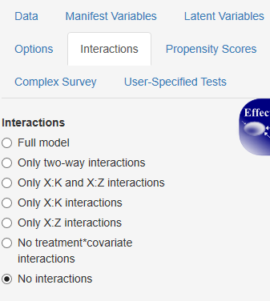
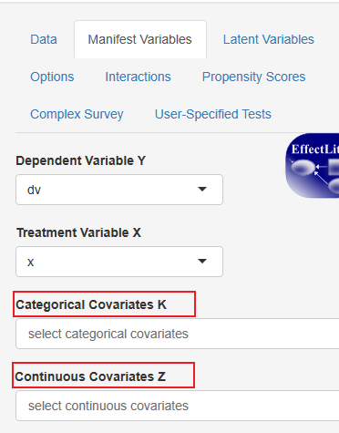
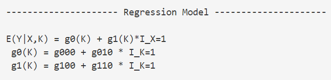
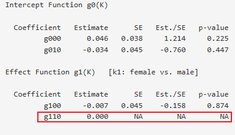
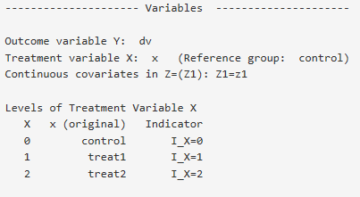
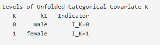
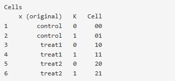
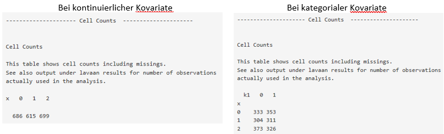
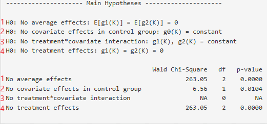

---
output:
  html_document: default
  pdf_document: 
      keep_tex: yes
---
```{r, echo=FALSE, include=FALSE}
library(knitr)
```

# Zweifache lineare Regression{#zwei}

Die zweifache lineare Regression erlaubt es einen zweiten Regressor zur Vorhersage des Regressanden hinzuzuziehen, ohne jedoch eine mögliche Interaktion zwischen den Regressoren zu berücksichtigen beziehungsweise zu schätzen. 
Interaktionen werden gewöhnlich nur dann aus einem Messmodell ausgeschlossen, wenn es starke theoretische oder statistische Indizien dafür gibt, dass keine Interaktionen vorliegen. Im vorliegenden Tutorial wird die zweifache lineare Interaktion an diesem Punkt hauptsächlich aus didaktischen Gründen: In der zweifachen linearen Regression werden weniger Parameter geschätzt als in der bedingten lineare Regression, somit wird das Verständnis der bedingten linearen Regression schrittweise vorbereitet. 

## Input

###	Modell

Die Default-Einstellung von EffectLiteR ist die bedingte lineare Regression, die nicht nur die Effekte der Regressoren auf den Regressanden, sondern zusätzlich noch den Einfluss der Interaktion zwischen den Regressoren auf den Regressanden schätzt. Möchte man solche Interaktionseffekt nicht schätzen, muss man dies einstellen. Das geht wie folgt:  
Im Input-Panel auf *interactions* klicken und *no interactions* auswählen.

```{r, echo=FALSE, fig.cap="Modell-Definition als zweifache lineare Regression",fig.align='left', out.width = '40%', warning=FALSE, message=FALSE, fig.pos="htbp"}

```

### Variablen

Wie bei der einfachen linearen Regression ist es nötig unter dem Reiter *Manifest Variables* im Input-Panel eine abhängige Variable und eine (kategoriale) Treatmentvariable zu definieren. Zusätzlich muss der zweite Regressor als Kovariate definiert werden. Ist die Kovariate kategorial sollte sie durch Auswählen der Variable unter *Categorical Covariates K* als kategorial definiert werden, ist sie kontinuierlich, sollte sie unter *Continous Covariates Z* als kontinuierlich definiert werden.

```{r, echo=FALSE, fig.cap="Definition der Kovariate der zweifachen linearen Regression", fig.align='left',out.width = '40%', warning=FALSE, message=FALSE, fig.pos="htbp"}

```

## Parametrisierung 

Die Interpretation der Parameter der zweifachen linearen Regression unterscheidet sich dementsprechend, ob der zweite Regressor kontinuierlich oder kategorial ist. Wir gehen beide Fälle an jeweils einem Beispiel durch.

### Parameter-Interpretation bei kategorialer Kovariate  

Zur modellierung der zweifachen linearen Regression werden im Fall einer zweistufigen Treatmentvariablen und einer ebenfalls zweistufigen kategorialen Kovariaten drei Parameter und zwei Indikatorvariablen genutzt:

\begin{align}
 E(Y|X,K) = g_{000} + g_{010} \times I_{K=1} + g_{100} \times I_{X=1}
 (\#eq:zwei1)
\end{align}
  
Die Benennung der Parameter mit g000, g010 g100 entspricht der Benennung der Parameter durch EffectLiteR und wird am [gegen Ende dieses Abschnitts](#zweibenennungpara) erklärt.  

Wir drücken die Parameter wie bereits bei der einfachen linearen Regression mit Erwartungswerten aus, um ihre Bedeutung zu verstehen. Außerdem ergänzen wir unser bereits bekanntes Beispiel für die zweifache lineare Regression um eine weitere Variable:

[**Beispiel 3**]{#bspdrei}  
*Abhängige Variable* $\small Y$*: Gesundheitsscore von Patienten.*  
*Treatmentvariable* $\small X$*: Erhalten Patienten eine (*$\small X=1$*) oder erhalten sie keine (*$\small X=0$*) Behandlung.*  
*Kovariate *$\small K$*: Patient gibt an in seinem Umfeld ausreichend soziale Unterstützung zu erhalten (*$\small K=1$*) bzw. nicht genug Unterstützung zu erhalten (*$\small K=0$*).*  

*Beachte: Wir gehen (in diesem Fall aus didaktischen Gründen) davon aus, dass es keine Interaktion zwischen Treatmentvariable *$\small X$ *und Kovariate *$\small K$ *gibt und verzichten deshalb darauf diese Interaktion zu modellieren.*

#### Parameter g000{#zweiparakat}

In der Modell-Gleichung \@ref(eq:zwei1) für dieses Beispiel gibt es drei Parameter und zwei Indikatorvariablen. Eine Indikatorvariable für die Treatmentvariable $\small X$ und eine für die kategoriale Kovariate $\small K$. Unter der Bedingung, dass sowohl $\small X$ als auch $\small K$ die Ausprägung Null annehmen, nehmen beide Indikatorvariablen ebenfalls den Wert Null an:

\begin{align}
E(Y|X=0,K=0) &= g_{000} + g_{010} \times I_{K=1} + g_{100} \times I_{X=1}\notag\\
             &= g_{000} + g_{010} \times 0 + g_{100} \times 0\notag\\
g_{000}&=E(Y|X=0,K=0)
(\#eq:zwei2)
\end{align}

Der Parameter g000 schätzt also die Ausprägung des Regressanden unter der Bedingung $\small X = 0$ und $\small K = 0$. In unserem [Beispiel 3](#bspdrei) schätzt g000 den Gesundheitsscore von Patienten mit subjektiv zu geringer sozialer Unterstützung, die keine Behandlung erhalten. 

#### Parameter g010

Um den Parameter g010 interpretieren zu können betrachten wir den Fall $\small X = 0$, $\small K = 1$. In diesem Fall wird nämlich der Parameter g100 mit Null multipliziert und wird somit irrelevant, während der Parameter g010 erhalten bleibt (Zeile 2 der Gleichungen \@ref(eq:zwei3)).

\begin{align}
E(Y|X=0,K=0) &= g_{000} + g_{010} \times I_{K=1} + g_{100} \times I_{X=1}  \notag\\
             &= g_{000} + g_{010} \times 1 + g_{100} \times 0              \notag\\
             &= E(Y|X=0,K=0) + g_{010}                                     \notag\\
g_{010} &= E(Y|X=0,K=1) - E(Y|X=0,K=0) 
(\#eq:zwei3)
\end{align}

In Zeile drei der Gleichungen \@ref(eq:zwei3) wird der Erwartungswert $\small E(Y|X=0,K=0)$ für g000 (siehe Gleichungen \@ref(eq:zwei2)) eingesetzt, Zeile vier stellt die Gleichung nach g010 um.  
Der Parameter g010 schätzt somit die Differenz des Erwartungswertes von $Y$ unter der Bedingung $\small X = 0$ und $\small K = 0$ und unter der Bedingung $\small X = 0$ und $\small K = 1$. Damit schätzt der Parameter g010 den Effekt, den eine Veränderung von $\small K = 0$ zu $\small K = 1$ auf $Y$ ausübt. In unserem Beispiel schätzt g010 also den Effekt der subjektiven sozialen Unterstützung der Patienten auf ihren Gesundheitsscore.

Wenn wir uns die letzte Zeile von Gleichung \@ref(\#eq:zwei3) etwas genauer anschauen, sehen wir, dass die Erwartungswerte, die wir hier vergleichen, zwei Bedingungen haben: Die Gleichung vergleicht den Erwartungswert von $Y$ gegeben $K=1$ *und* $X=0$ mit dem Erwartungswert von $Y$ gegeben $K=0$ *und* $X=0$. Genau genommen müssten wir also sagen: g010 schätzt den Effekt, den eine Veränderung von $\small K = 0$ zu $\small K = 1$ *unter der Bedingung* $X=0$ auf $Y$ ausübt. Diesen kursiv geschriebenen Zusatz können wir bei der zweifachen linearen Regression allerdings weglassen: Per Definition gibt es hier keine Interaktion zwischen der Treatment-Variable $X$ und der Kovariaten $K$, das heißt der Effekt der Kovariaten ist unter der Bedingung $X=0$ identisch mit dem unbedingten Effekt der Kovariaten. Bezogen auf unser Beispiel heiße das: Der Effekt der subjektiv berichteten sozialen Unterstützung, die Patienten erhalten, auf ihren Gesundheitsscore ist (per Definition) unabhängig davon, ob die Patienten eine Behandlung erhalten oder nicht. 

#### Parameter g100

Betrachten wir den Fall $\small X = 1$ und $\small K = 0$ um Parameter g100 zu interpretieren. In diesem Fall  wird der Parameter g010 mit Null multipliziert, während der Parameter g100 erhalten bleibt:

\begin{align}
E(Y|X=1,K=0) &= g_{000} + g_{010} \times I_{K=1} + g_{100} \times I_{X=1} \\
             &= g_{000} + g_{010}\times 0 + g_{100}\times 1 \notag\\
             &= E(Y|X=0,K=0) + g_{100} \notag\\
g_{100} &= E(Y|X=1,K=0) - E(Y|X=0,K=0) \notag
(\#eq:zwei4)
\end{align}

Das Vorgehen ist das selbe wie bei der Berechnung von Parameter g010.  
Der Parameter g100 schätzt also die Differenz in $\small Y$ zwischen der Bedingung $\small X = 0$ und $\small K = 0$ und der Bedingung $\small X = 1$, $\small K = 0$. Damit schätzt der Parameter den Treatmenteffekt, den eine Veränderung von $\small X = 0$ zu $\small X = 1$ auf $\small Y$ ausübt. Genau genommen haben wir hergeleitet, dass g010 den Treatmenteffekt von $\small X$ unter der Bedingung $\small K = 0$ beschreibt. Da die zweifache lineare Regression allerdings keine Interaktion zwischen $\small K$ und $\small X$ zulässt ist der Treatmenteffekt der Variablen $\small X$ unabhängig von der Ausprägung von $\small K$. Die Bedingung $\small K = 0$ kann in diesem Fall also weggelassen werden.
In unserem Beispiel 3 schätzt g100 den Effekt einer Behandlung auf den Gesundheitsscore (unabhängig von der subjektiven sozialen Unterstützung der Patienten). 

#### Die Benennung der Parameter{#zweibenennungpara}

Die erste der drei Ziffern der von EffectLiteR geschätzten Parameter-Indizes bezieht sich auf die Ausprägung der Treatmentvariablen $X$, die zweite der drei Ziffern auf die Ausprägung der kategorialen Kovariaten $K$ und die dritte der drei Ziffern auf die kontinuierliche Kovariate $Z$ (Kontinuierliche Kovariaten wurden in diesem Tutorial bisher noch nicht eingeführt). Parameter g000 Bezieht sich also auf den Erwartungswert unter der Bedingung $\small X=0,K=0$, g010 beziffert den Effekt der Kovariaten  $\small K=1$ unter der Bedingung $\small X=0$ und der Parameter g100 auf den Effekt der Ausprägung  $\small X=1$ der Treatmentvariable.

#### [Von EffectLiteR angezeigtes Regressionsmodell]{#angezeigtesregressionsmodell}

Rechnet man eine zweifache lineare Regression für eine zweistufige Treatment-Variable und eine ebenfalls zweistufige kategoriale Kovariate mit EffectLiteR, so erhält man Schätzungen für die drei bisher behandelten Parameter: g000, g010 und g100. Das Modell, dass EffectLiteR dem Nutzer anzeigt ist allerdings das „vollständige“ Modell der bedingten linearen Regression. Dies bedeutet, dass zusätzlich noch ein Parameter g110 angezeigt wird (in der bedingten linearen Regression würde dieser Parameter den Interaktionseffekt zwischen $\small X$ und $\small K$ schätzen). 
Da du für die zweifache lineare Regression allerdings unter *Options* festgelegt hast, dass es keine Interaktionen geben soll, wird der g110-Parameter von EffectLiteR auf Null festgelegt. Du kannst diesen Parameter bei der Interpretation also ignorieren. Dies soll im Folgenden verdeutlicht werden:

Figure \@ref(fig:fzwei3) bildet das von EffectLiteR im Hauptoutput angezeigte Regressionsmodell ab.

```{r, fzwei3, echo=FALSE, fig.cap="Von EffectLiteR angezeigtes Regressionsmodell", fig.align='center', out.width = '60%', warning=FALSE, message=FALSE, fig.pos="htbp"}

```

Durch Einsetzen der Parameter in die g0(K)- und g1(K)- Funktion erhält man Gleichung \@ref(eq:zwei5):

\begin{align} 
E(Y|X,K) = (g_{000} + g_{010} \times I_{K=1}) + (g_{100} + g_{110}\times I_{K=1}) \times I_{X=1}
(\#eq:zwei5)
\end{align}

Da der „Interaktions-Parameter“ g110 bei der zweifachen linearen Regression auf Null fixiert wird, ergibt sich die bekannte Regressionsgleichung der zweifachen linearen Regression, deren Parameter wir soeben interpretiert haben:

\begin{align} 
E(Y|X,K) &= (g_{000} + g_{010} \times I_{K=1}) + (g_{100} + 0\times I_{K=1}) \times I_{X=1}\\
&= (g_{000} + g_{010} \times I_{K=1}) + (g_{100}) \times I_{X=1}\notag
\end{align}

Im Parameteroutput wird der auf Null fixierte Parameter wie folgt angezeigt:

```{r, echo=FALSE, fig.cap="Output des auf Null fixierten 'Interaktionsparameters' g110",fig.align='center', out.width = '60%', warning=FALSE, message=FALSE, fig.pos="htbp"}

```

### Parameter-Interpretation bei kontinuierlicher Kovariate{#zweikont}  

Das Regressionsmodell der zweifachen linearen Regression mit einer kontinuierlichen Kovariaten ähnelt dem Modell mit kategorialen Kovariaten stark. Hier einmal im Vergleich:

kategoriale Kovariate                                         | kontinuierliche Kovariate 
-----------------------------------------------------------   | ----------------------------------------------------------- 
$E(Y|X,K) = g_{000} + g_{010} \times I_{K=1} + g_{100} \times I_{X=1}$ | $E(Y|X,Z_1) = g_{000} + g_{001} \times Z_1 + g_{100} \times I_{X=1}$


Der Unterschied zwischen beiden Regressionsgleichungen liegt darin, dass für eine kontinuierliche Kovariaten keine Indikatorvariable gebildet werden muss, sondern der Parameter g001 direkt mit der Ausprägung der Kovariaten multipliziert wird. Dass der Parameter für die Kovariate mit g001 statt g010 bezeichnet wird, trägt der Tatsache Rechnung, dass er sich auf den Effekt einer kontinuierlichen Kovariate bezieht (zur Benennung der Parameter lese [hier](#zweibenennungpara)).  
Kontinuierliche Kovariaten können so viele Werte annehmen, dass es nicht sinnvoll ist für jede empirisch gefundene Ausprägung eine eigene Indikatorvariable zu bilden. Um den Erwartungswert einer Person mit einer Kovariatenausprägung $\small Z_1=z_1$ gegeben $\small X$ zu errechnen, kann der Wert $\small z_1$ direkt für $\small Z_1$ in der oberen rechten Gleichung eingesetzt werden. Der Parameter g001 gibt für die kontinuierliche Kovariate also an, wie stark sich der Erwartungswert von $\small Y$ verändert, wenn die Kovariatenausprägung von $\small Z_1$ um eine Einheit steigt.

Auch für den Fall einer kontinuierlichen Kovariaten möchten wie die Parameter durch Erwartungswerte ausdrücken, um sie inhaltlich zu verstehen. Zur besseren Veranschaulichung greifen wir auf folgendes Beispiel zurück: 

[**Beispiel 4**]{#bspvier}  
*Nehmen wir an, wir erfassen, anders als in [Beispiel 3](#bspdrei) die Variable subjektive soziale Unterstützung statt als dichotome Variable (gegeben/nicht gegeben) als kontinuierliche Variable auf einer neun-stufigen Likert-Skala. Ansonsten nehmen wir keine Veränderungen gegenüber Beispiel 3 vor. Es ergeben sich folgende Variablen:*  
*Abhängige Variable Y: Gesundheitsscore von Patienten.*  
*Treatmentvariable X: Erhalten Patienten eine (*$\small X=1$*) oder erhalten sie keine (*$\small X=0$*) Behandlung.*  
*Kovariate* $\small Z_1$*: Beschreibt die wahrgenommene soziale Unterstützung auf einer Skala von 1-10.*  

*Beachte: Wir gehen noch immer (aus didaktischen Gründen) davon aus, dass es keine Interaktion zwischen Treatmentvariable X und Kovariate* $\small Z_1$ *gibt und verzichten deshalb darauf diese Interaktion zu modellieren.* 


#### Parameter g000{#zweiparameterkont}

Um den Parameter g000 interpretieren zu können müssen die Parameter g010 und g100 aus der Modellgleichung rausfallen, d.h. sie müssen mit Null multipliziert werden.  

Der Parameter g010 fällt weg, wenn die Kovariate $\small\ Z_1$ den Wert Null annimmt. In unserem Beispiel kann die Kovariate (gefühlte soziale Unterstützung) nicht direkt den Wert Null annehmen, da ihre Skala von 1-10 reicht. Es wäre also wünschenswert die Kovariate so zu Transformieren, dass sie einen Wert Null bekommt.

[**Einschub: Transformation der Kovariaten**]{#zweizstand}  
*Eine mögliche Transformation für die Kovariate aus unserem Beispiel wäre von jedem Skalenwert (*$\small 1-10$*) jeweils eins abzuziehen, sodass die transformierte Skala von* $\small 0-9$ *reichen würde(*$\small Z_1 '=Z_1-1$*). Zur besseren Interpretierbarkeit des Einflusses der Kovariaten wird die Skala allerdings z-transformiert, das heißt die Skala der Kovariaten wird so transformiert, dass sie einen Mittelwert von* $\small \bar{z_1} =0$ *und einer Standardabweichung von* $\small SD_{Z1}=1$ *erhält. Der Vorteil der z-Standardisierung ist der, dass der Parameter g010 nun den Einfluss einer Steigerung der Kovariaten um eine Standardabweichung angibt und nicht mehr den Einfluss der Steigerung um einen Skalenpunkt. Ein weiterer Vorteil liegt darin, dass die Parameter g000 und g100 durch diese z-Transformation der Kovariaten als durchschnittliche Effekte interpretierbar werden. Lese hierzu weiter im Text.*  
*Eine Variable kann mit folgender Formel z-standardisiert werden:* $\small X_{z-stand.}=\frac{X-\bar{x}}{SD_X}$*, wobei* $\small\bar{x}$ *den Mittelwert der zu transformierenden Variable und* $\small SD_X$ *ihre Standardabweichung bezeichnet.*

Betrachten wir also den Erwartungswert von $Y$ unter der Bedingung $\small Z_1=\bar{z}_1 =0$ und $\small X=0$:

\begin{align}
E(Y|X=0,Z_1=\bar{z}_1=0) &= g_{000} + g_{001} \times Z_1 + g_{100} \times I_{X=0}\notag\\
                         &= g_{000} + g_{001} \times 0 + g_{100} \times 0\notag\\
g_{000} &= E(Y|X=0,Z_1= \bar{z}_1=0)
(\#eq:zwei6)
\end{align}

Der Parameter g000 schätzt bei einer z-standardisierten Skala also den von Z unabhängigen oder auch durchschnittlichen Erwartungswert von $\small Y$ (unter der Bedingung $\small X=0$, weil es bei der zweifachen linearen Regression keine Interaktionen zwischen Treatment-Variable und Kovariaten gibt kann diese Bedingung ignoriert werden).
In unserem Beispiel schätzt g000 den erwarteten Gesundheitsscore von Personen mit einer durchschnittlichen Ausprägung der Kovariaten „gefühlte soziale Unterstützung“ (unter der Bedingung, dass keine Behandlung erfolgt). Damit schätzt der Parameter auch den Durchschnitt der Effekte von $\small X=1$, die für alle Personen der Stichprobe einzeln geschätzt werden.

#### Parameter g001

Um den Parameter g001 interpretieren zu können, muss der Parameter g100 aus der Modellgleichung rausfallen, d.h. mit Null multipliziert werden, während der Parameter g001 erhalten bleibt.  
Ist die Ausprägung der Kovariaten $\small Z_1$ genau eine Standardabweichung größer als ihr Mittelwert $\small \bar{z}$ so nimmt sie aufgrund der z-Standardisierung den Wert $\small 1$ an. der Parameter g001 wird unter der Bedingung $\small Z_1=\bar{z}_1+SD_{Z1}=1$ also mit Eins multipliziert, was seine Interpretation erleichtert. Der Parameter g100 wird unter der Bedingung $\small X \neq 1$ (in unserem Beispiel $\small X=0$) mit Null multipliziert. In Gleichungen ausgedrückt:

\begin{align}
E(Y|X=0,Z_1= \bar{z}_1+SD_{Z1}=1) = g_{000} + g_{001} \times 1 + g_{100} \times 0
(\#eq:zwei7)
\end{align}

Durch Einsetzen von $\small E(Y|X=0,Z_1= \bar{z}_1 = 0)$ für g000 in Gleichung \@ref(eq:zwei7) erhalten wir:

\begin{align}
E(Y|X=0,Z_1= \bar{z}_1+ SD_{Z1}=1) = E(Y|X=0,Z_1= \bar{z}_1=0) + g_{001}\notag\\
g_{001} = E(Y|X=0,Z_1= \bar{z}_1+ SD_{Z1}) - E(Y|X=0,Z_1= \bar{z}_1)
(\#eq:zwei8)
\end{align}

Dies Bedeutet: Der Parameter g001 schätzt die Differenz in $\small Y$ für Personen mit einer durchschnittlichen Kovariaten-Ausprägung und solchen mit einer um eine Standardabweichung größeren Kovariatenausprägung (unter der Bedingung  $\small X=0$). Die Bedingung $\small X=0$ hat, wie schon für das Beispiel mit der kategorialen Kovariaten erklärt, keine Bedeutung, weil in der zweifachen linearen Regression Interaktionen ausgeschlossen werden.
In unserem Beispiel drückt der Parameter also die erwartete Differenz im Gesundheitsscore für Personen mit durchschnittlicher Ausprägung in der Kovariaten „gefühlter sozialer Unterstützung“ und solchen mit um eine Standardabweichung überdurchschnittlicher „gefühlter sozialer Unterstützung“ aus.

#### Parameter g100

Für die Interpretation des Parameters g100 betrachten wir den Erwartungswert von $\small Y$ unter der Bedingung $\small X=1$ (damit die Indikatorvariable $\small I_{X=1}$ den Wert Eins annimmt) und $\small Z_1= \bar{z}_1=0$ (damit der Parameter g001 mit Null multipliziert wird):

\begin{align}
E(Y|X=1,Z_1= \bar{z}_1=0) = g_{000} + g_{001} \times 0 + g_{100} \times 1
(\#eq:zwei9)
\end{align}

Durch Einsetzen von $\small E(Y|X=0,Z_1=\bar{z}_1=0)$ für g000 in Gleichung \@ref(eq:zwei9) erhalten wir:

\begin{align}
E(Y|X=1,Z_1= \bar{z}_1=0) &= E(Y|X=0,Z_1=\bar{z}_1=0) + g_{100}\\
g_{100} &= E(Y|X=1,Z_1= \bar{z}_1) - E(Y|X=0,Z_1=\bar{z}_1)
(\#eq:zwei10)
\end{align}

Der Parameter g100 schätzt also (wie auch bei der zweifachen linearen Regression mit kategorialer Kovariaten) die Abweichung zwischen der Ausprägung von $\small Y$ im Fall $\small X=0$ und im Fall $\small X=1$ (unter der Bedingung $\small Z_1 = \bar{z}_1=0$, die in der zweifachen linearen Regression nicht beachtet werden muss, da keine Interaktionen zugelassen werden). Der Parameter g100 schätzt damit den Effekt den das Treatment (in unserem Beispiel eine Behandlung) auf die abhängige Variable (in unserem Beispiel den Gesundheitsscore) ausübt. 

#### Von EffectLiteR angezeigtes Regressionsmodell

Wie schon im Beispiel mit der kategorialen Kovariaten wird auch bei Verwendung einer kontinuierlichen Kovariaten das „vollständige Modell“ der bedingten linearen Regression mit einem auf Null fixierten Interaktionsparameter angezeigt, synonym wie [oben](#angezeigtesregressionsmodell) beschrieben, kann hergeleitet werden, dass der auf Null fixierte Parameter keine Auswirkungen auf die Schätzung der anderen Parameter hat und im Output ignoriert werden kann.

## Hauptoutput{#zweihaupt}

In der Beschreibung des Hauptoutputs der zweifachen linearen Regression wird an mehreren Stellen auf die Beschreibung des Hauptoutputs der einfachen linearen Regression verwiesen. Es ist von Vorteil sich zuerst mit dem Output der einfachen linearen Regression vertraut zu machen. 

### Variables{#zweivariables}

Hier wird angezeigt, welche Variablen im Modell als Prädiktor bzw. Regressor berücksichtigt wurden. Außerdem wird wieder die Zuordnung der ursprünglichen Variablenkodierung zu den umkodierten Variablenlevels und der entsprechenden Indikatorvariable angezeigt. Auch hier wird dargestellt, welche Gruppe als Referenzgruppe verwendet wird.


```{r, echo=FALSE, fig.cap="Variables-Output: Umkodierung der Treatmentvariablen",fig.align='center', out.width = '60%', warning=FALSE, message=FALSE, fig.pos="htbp"}

```

In der Beispielgraphik oben kann abgelesen werden, dass die Kategorie „control“ mit $\small 0$ kodiert ist. Die Indikatorvariable $\small I_{X=0}$ nimmt also für Probanden der Kontrollgruppe den Wert Eins und für anderen Probanden den Wert Null an.

Im Falle einer kategorialen Kovariaten wird eine vergleichbare Umkodierung auch für die Kovariate vorgenommen und ist ebenfalls unter Variables [nachvollziehbar]{#zweivariablescells}: 

```{r, echo=FALSE, fig.cap="Variables-Output: Umkodierung der kategorialen Kovariaten",fig.align='center', out.width = '60%', warning=FALSE, message=FALSE, fig.pos="htbp"}

```

In diesem Beispiel kann also abgelesen werden, dass die Kategorie „male“ von EffectLiteR mit $\small 0$ kodiert wird. Die Indikatorvariable $\small I_{K=0}$ nimmt also für männliche Probanden den Wert Eins und für nicht männliche Probanden den Wert Null an.   

Ebenfalls nur bei kategorialen Kovariaten ist eine Bezeichnung verschiedener Zellen zu finden. Für jede Kombination der verschiedenen Ausprägungskombinationen aus Treatmentvariable und Kovariate wird eine Zelle gebildet und mit einer Zahl benannt. Unter *Cells*, weiter unten im Hauptoutput, kann dann die Anzahl an Beobachtungen pro Zelle nachgesehen werden, auch einige [Plots](#plots) beziehen sich auf einzelne Zellen. 

```{r, echo=FALSE, fig.cap="Anzahl an Beobachtungen pro Zelle unter *Cells*", fig.align='center', out.width = '60%', warning=FALSE, message=FALSE, fig.pos="htbp"}

```

### Regression Model

Im Output des Regressionsmodells und der Paramter gibt es keine größeren Unterschiede zum Output der einfachen linearen Regression, bis auf den Fakt, dass natürlich mehr Parameter geschätzt werden und dementsprechend auch für mehr Parameter Schätzwert, Standardfehler und p-Wert angegeben werden.
Wie bereits im Abschnitt *[Von EffectLiteR angezeigtes Regressionsmodell](#angezeigtesregressionsmodell)* beschreiben, wird auch ein oder mehrer auf Null fixierter Interaktions-Parameter angezeigt, die bei der Interpretation ignoriert werden können:


```{r, echo=FALSE, fig.cap="Variables-Output: Output mit einem auf Null fixierten Interaktions-Parameter",fig.align='center', out.width = '60%', warning=FALSE, message=FALSE, fig.pos="htbp"}

```

### Cell Counts

Im Falle einer kategorialen Kovariaten wird eine Tabelle mit Beobachtungen in einer Kombination aller möglichen Variablenausprägungskombinationen angezeigt, im Falle einer kontinuierlichen Kovariaten werden nur die Beobachtungen für die Ausprägungen der Treatmentvariable gezählt:

```{r, echo=FALSE, fig.cap="Cell Counts: Output bei kontinuierlicher und kategorialer Kovariate", out.width = '100%', warning=FALSE, message=FALSE, fig.pos="htbp"}

```

Der Output (bei kategorialer Kovariate) ist wie folgt zu lesen: Es wurden 333 Fälle mit der Ausprägung $\small X= 0$ und $\small K=0$ beobachtet. Unter [*Variables-Cells*](#zweivariablescells) kann nachgelesen werden, wofür diese Ausprägungen stehen: Es wurden 333 Männer unter der Bedingung „control“ beobachtet.

### Main Hypotheses{#zweimainhypo}

Betrachten wir mehr als nur einen Prädiktor, gibt es auch mehr Möglichkeiten Hypothesen über mehrere Parameter zugleich zu testen. Dabei gilt: Die Tests im Bereich *Main Hypotheses* können ohne Bedenken bezüglich etwaiger $\alpha$-Fehler-Kumulierung interpretiert werden.
Im Fall der zweifachen linearen Regression lassen sich die Hypothesen 1,2 und 4 interpretieren. Die dritte Hypothese, die sich auf Interaktionen bezieht, gewinnt erst bei der bedingten linearen Regression Bedeutung.

```{r, zweihypo, echo=FALSE, fig.cap="Haupthypothesen-Tests", fig.align='center', out.width = '70%', warning=FALSE, message=FALSE, fig.pos="htbp"}

``` 

#### [Hypothesentest 1]{#zweihypothesentesteins}

Getestet wird die Nullhypothese, dass die Erwartungswerte für alle Effektfunktionen gleich Null sind. Im Screenshot hat die Treatment-Variable drei Ausprägungen, dementsprechend gibt es zwei Effektfunktionen [$\small g1(K)$ und $\small g2(K)$]. Die Nullhypothese besagt, dass die Effekte beider Effektfunktionen für alle Fälle des Beispiels im Durchschnitt den Wert Null annehmen bzw. dass weder das mit Eins noch das mit Zwei kodierte Treatment einen Effekt über das mit Null kodierte Treatment hinaus haben. Dies könnte auch wie folgt ausgedrückt werden: $\small E[g0(K)] = E[g1(K)] = E[g2(K)]$. In dieser Schreibweise ist leichter nachvollziehbar, woraus sich die Anzahl der Freiheitsgrade ($\small df=2$) ergibt: Die Freiheitsgerade errechnen sich durch die Anzahl miteinander verglichener Gruppen minus $\small 1$.  
Wird der Test signifikant ($\small p < 0.05$) muss die Hypothese verworfen werden und man kann davon ausgehen, dass durchschnittliche Effekt des Treatments vorhanden sind, wird der Test nicht signifikant kann die Nullhypothese angenommen werden (unter der Annahme, dass die Power der getesteten Regressions-Analyse ausreichend groß ist).

**Bemerke:**  
*Dass die Effektfunktionen im Durchschnitt den Wert Null annehmen, bedeutet im Fall der zweifachen linearen Regression, dass es keine Treatment-Effekte gibt. Für die zweifache lineare Regression gibt es dementsprechend keine Unterschiede zwischen Hypothesentest 1 und Hypothesentest 4. Eine Unterscheidung zwischen diesen beiden Hypothesentests macht erst dann Sinn, wenn Interaktionen zwischen Treatment und Kovariaten geschätzt werden (wie in der bedingten linearen Regression). Dann kann es nämlich vorkommen, dass ein Treatment zwar unter bestimmten Bedingungen einen Effekt hat (getestet von Hypothese 4), im Durchschnitt aber keinen Effekt hat (Hypothesentest 1). Bei der zweifachen linearen Regression gibt es keine Interaktionen, somit ist der Effekt des Treatments unter allen Bedingungen von K identisch und der durchschnittliche Effekt gleicht den bedingten Effekten.* 

#### Hypothesentest 2

Getestet wird hier, ob es in der Kontrollgruppe Einflüsse der Kovariaten gibt. Da es bei der zweifachen linearen Regression keine Interaktionen zwischen Tretment-Variable und Kovariate gibt, testet dieser Test defacto ob die Kovariate überhaupt Einflüsse auf die abhängige Variable hat (wenn die Kovariate in der Kontrollgruppe keinen Einfluss auf die abhängige Variable hat und es keine Interaktionen gibt, dann hat die Kovariate auch in allen anderen Bedingungen keinen Einfluss auf die abhängige Variable). 
Hat die Kovariate keinen Einfluss auf die abhängige Variable (dies entspräche der getesteten Nullhypothese) so ist der Erwartungswert der Referenzgruppe unter allen Bedingungen von K identisch.   
Für den im Screenshot oben (Figure \@ref(fig:zweihypo)) abgebildeten Fall mit zwei Kovariaten-Ausprägungen ließe sich die Nullhypothese in der Kontrollgruppe ($\small X=0$) formal wie folgt aufschreiben: $\small E(Y|X=0,K=0) = E(Y|X=0,K=1)$. Da der Einfluss von K auf den Erwartungswert von Y unter allen Bedingungen von X jedoch gleich ist, wenn keine Interaktionen vorliegen, kann in der zweifachen linearen Regression verallgemeinert werden: $\small E(Y|X,K=0) = E(Y|X,K=1)$. Da zwei Gruppen miteinander verglichen werden (die Gruppe mit der Ausprägung $\small K = 0$ und die mit der Ausprägung $\small K=1$) haben wir ($\small 2-1=1$) einen Freiheitsgrad.
Alternativ könnte man die Gleichung auch wie folgt ausdrücken: $\small g_{010} = 0$. Der Parameter g010 drückt den Effekt der Kovariaten aus.
Im Fall des Screenshots (siehe Abbildung oben) wird der Hypothesentest signifikant, das heißt die Nullhypothese kann verworfen werden: Mit einer Wahrscheinlichkeit von 98,96% (1 minus p-value) verändert sich der der Wert der abhängigen Variable auf Populationsebene in Abhängigkeit der Ausprägung der Kovariaten.

#### Hypothesentest 3

Da es bei der zweifachen linearen Regression keine Interaktionen zwischen Treatment und Kovariate gibt, kann der Test über Interaktionsparameter nicht berechnet werden.

#### Hypothesentest 4

Wie bereits unter [Hypothesentest 1](#zweihypothesentesteins) beschrieben unterscheidet sich der Hypothesentest 4 bei der zweifachen linearen Regression nicht von Hypothesentest 1.

### Adjusted Means

Wie bei der einfachen linearen Regression werden Mittelwerte für die Ausprägung der abhängigen Y-Variablen unter verschiedenen Bedingungen von $\small X$ angezeigt. Die adjustierten Mittelwerte lassen sich im Fall der zweifaktoriellen Regression genauso interpretieren, wie im Fall der [einfachen linearen Regression](#einsadjustedmeans), da über die verschiednen Kovariaten-Ausprägungen gemittelt wird.
Dass es sich um adjustierte Mittelwerte handelt bedeutet, dass bedingte Erwartungswerte (zum Beispiel der Erwartungswert von $\small X=0$ unter der Bedingung $\small K=0$) für alle Zellen (siehe [*Variables – Cells*](#zweivariablescells)) gebildet werden und dann entsprechend der proportionalen Häufigkeit der Ausprägungen der Kovariaten im Datensatz gewichtet werden. Da es bei der zweifachen linearen Regression per Definition keine Interaktion zwischen Kovariate und Treatmentvariable gibt, gibt es keine Unterschiede zwischen den verschiedenen bedingten Erwartungswerten und es tritt kein Effekt der Adjustierung zu Tage. Eine tiefergehende Erklärung zu adjustierten Mittelwerten findet sich im [Exkurs adjustierte Mittelwerte](#exkadj).

### Average Effects

Die durchschnittlichen Effekte lassen sich im Fall der zweifaktoriellen Regression genauso interpretieren, wie im Fall der einfaktoriellen Regression, da über den zweiten Faktor, die Kovariate, gemittelt wird: Es werden die (durchschnittlichen) Effekte der Treatmentvarible geschätzt. 
EffectLiteR nutzt adjustierte Mittelwerte (adjusted means) um Effekte zu berechnen, viele andere Programme (u. a. SPSS) nutzen ungewichtete bedingte Randmittelwerte (marginal means) um Effekte zu berechnen. In unbalancierten Designs können die adjustierten Mittelwerte von den bedingte Randmittelwerten abweichen und sich somit auch die gefundenen Effekte zwischen EffectLiteR (durchschnittliche Effekte) und SPSS (Haupteffekte) unterscheiden. Dies ist ein Vorteil von EffectLiteR gegenüber SPSS. Siehe hierzu auch den [Exkurs Adjustierte Mittelwerte](#exkadj).
Durch das hinzufügen varianzaufklärender Kovariaten wird generell die Genauigkeit der Effektschätzung verbessert, das heißt der Standardfehler wird geringer.

### Effects given a Treatment Condition

Bei der zweifachen linearen Regression weichen die hier angezeigten Effekte nicht von den durchschnittlichen Effekten ab. Eine Erklärung des statistischen Konstruktes findet im Rahmen der bedingten linearen Regression statt.


### Hypotheses given K=k (nur bei einer kategorialen Kovariaten):

Hier wird der durchschnittliche Effekt von $\small X$ auf $\small Y$ unter den verschiedenen Bedingungen von $\small K$ getestet.
Da die zweifache lineare Regression keine Interaktionen zwischen $\small K$ und $\small X$ zulässt, ist der durchschnittliche Effekt von $\small X$ unter allen Bedingungen von $\small K$ identisch und somit auch mit dem unbedingten durchschnittlichen Effekt identisch, der durch den Haupthypothesentest 1 getestet wird.
Für die zweifache lineare Regression gibt es also keine Unterschiede zwischen den bedingten durchschnittlichen Effekten, die unter *Hypotheses given K=k* getestet werden und dem Hypothesentest 1 der unter [*Main Hypotheses*](#zweimainhypo) getestet wird.

## Übungen "zweifache lineare Regression"
### A)
Der [Übungsdatensatz 2](../Datensätze/EffectLiteR_Tutorial_Übungsdatensatz2.csv) enthält (unteranderem) simulierte Daten für das [Beispiel 3](#bspdrei) (allerdings mit drei statt zwei Treatment-Bedingungen). Lese den Datensatz ein, wähle Gesundheitsscore als abhängige Variable, Behandlungsart als Treatmentvariable und subjektiv ausreichend soziale Unterstützung als kategoriale Kovariate.
Interpretiere den Hauptoutput:

1. Wie groß ist der Erwartete Gesundheitsscore unter folgenden Bedingungen:
  *  Behandlungsart = 0, subj_ausreichend_soz_Unterstützung = 0
  *  Behandlungsart = 0, subj_ausreichend_soz_Unterstützung = 1
  *  Behandlungsart = 1, subj_ausreichend_soz_Unterstützung = 0
  *  Behandlungsart = 1, subj_ausreichend_soz_Unterstützung = 1
  *  Behandlungsart = 2, subj_ausreichend_soz_Unterstützung = 0
  *  Behandlungsart = 2, subj_ausreichend_soz_Unterstützung = 1
2. Wie groß ist der Effekt von Behandlungsart 1 im Vergleich zu Behandlungsart 0 und ist er signifikant?
3. Wie groß ist der Effekt von Behandlungsart 2 im Vergleich zu Behandlungsart 0 und ist er signifikant?
4. Wie groß ist der Effekt von subjektiv ausreichender sozialer Unterstützung und ist er signifikant?

### B)
Nutze nun subjektive soziale Unterstützung als kontinuierliche Kovariate (entferne die kategoriale Kovariate), ansonsten belasse alle Variablen wie in Teil A) der Übung. Die verwendeten Variablen entsprechen nun [Beispiel 4](#bspvier).
Berechne eine zweifache lineare Regression von Behandlungsart und subjektiv gemessener sozialer Unterstützung (kontinuierlich) auf den Gesundheitsscore.  
*Beachte:* Zur Lösung der Aufgabe ist es hilfreich, wenn die kontinuierliche Kovariate z-standardisiert ist. Die z-Standardisierung muss vor dem Einlesen in EffectLiteR erfolgen.  
Interpretiere den Hauptoutput: 

1. Wie groß ist der erwartete Gesundheitsscore unter den verschiedenen Ausprägungen von X a) bei durchschnittlicher Ausprägung der Kovariate und b) bei einer Kovariaten-Ausprägung von einer Standardabweichung über dem Durchschnitt.
2. Wie groß ist der Effekt von Behandlungsart 1 im Vergleich zu Behandlungsart 0 und ist er signifikant?
3. Wie groß ist der Effekt von Behandlungsart 2 im Vergleich zu Behandlungsart 0 und ist er signifikant?
4. Hat subjektive soziale Unterstützung einen signifikanten Einfluss auf den Gesundheitsscore? Welchen Effekt hat die Steigerung von subjektiver sozialer Unterstützung um anderthalb Standardabweichung auf den Gesundheitsscore?  


Lösungen und Videos zur Berechnung der Aufgaben sowie zur z-Standardisierung von Variablen findest du [hier](#lösungen).

 
