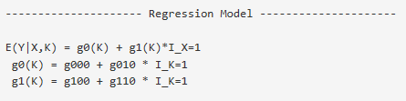
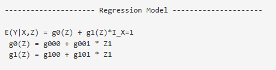
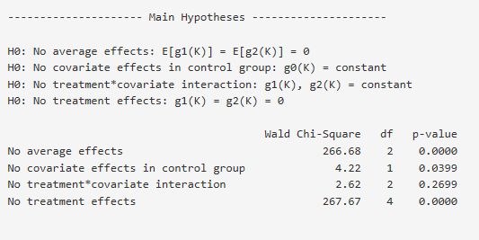
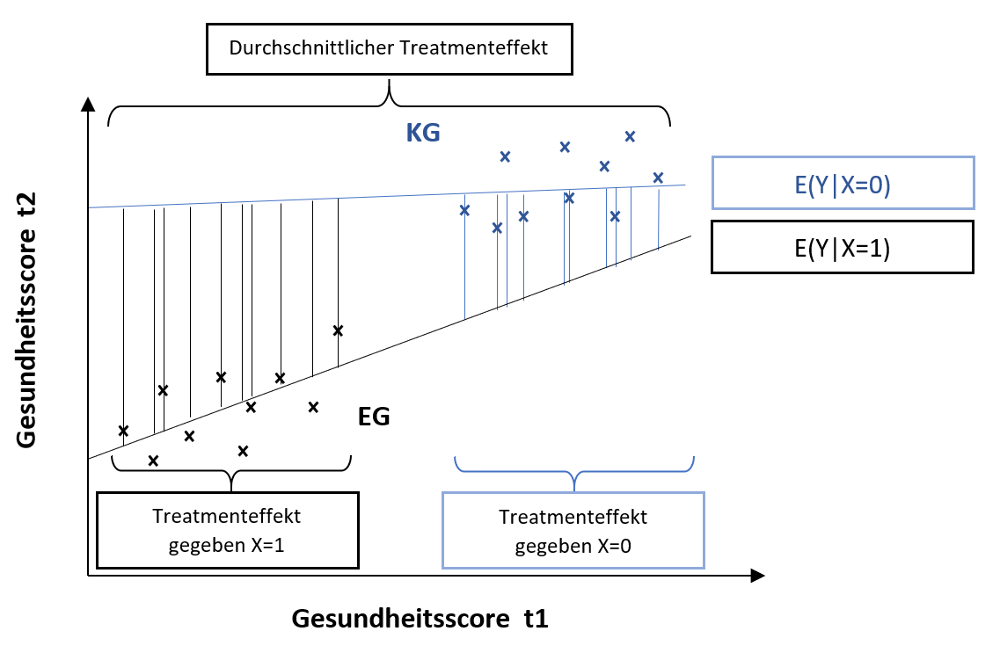
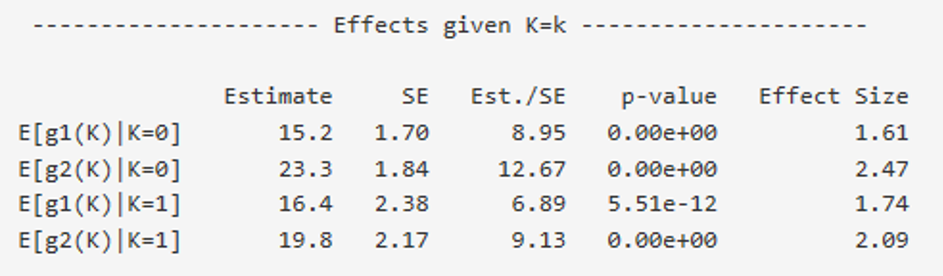
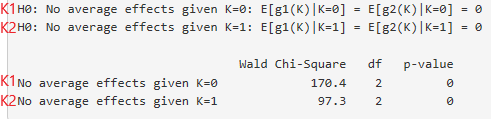

---
output:
  html_document: default
  pdf_document: default
---

```{r, echo=FALSE, include=FALSE}
library(knitr)
```

# Bedingte lineare Regression{#bedingt}

## Input

Wird EffectLiteR geöffnet, ein Datensatz eingelesen und unter *Manifest Variables* im Eingabe-Panel eine abhängige Variable, eine kategoriale Treatmentvarible sowie eine oder mehrere kategoriale oder kontinuierliche Kovariate(n) definiert (ausführliche Beschreibung zum Input siehe [Input der einfachen linearen Regression](#einsinput)), so schätzt EffectLiteR ein bedingtes lineares Regressionsmodell. Die bedingte lineare Regression ist die Defaulteinstellung von EffectLiteR.  
Sollten zuvor unter dem Reiter *Interactions* im Eingabe-Panel Änderungen vorgenommen worden sein, um beispielsweise eine zweifache lineare Regression zu schätzen, so kann die bedingte lineare Regression durch ein Klick auf *Full model* wieder hergestellt werden.

## Parametrisierung{#bedingtpara}

Anders als die zweifache lineare Regression lässt die bedingte lineare Regression eine Interaktion zwischen Treatmenteffekt und Kovariaten zu. Dies bedeutet, dass für jede geschätzte Interaktion (abhängig von der Anzahl der Stufen der Treatmentvariablen X, der Anzahl an Kovariaten, und der Anzahl an Stufen von kategorialen Kovariaten) ein weiterer Parameter in das Regressionsmodell aufgenommen wird.
Auch für die bedingte lineare Regression betrachten wir einfache Beispiele mit einer kategorialen bzw. einer kontinuierlichen Kovariaten. 

### Zweistufige Kovariate, zweistufige Treatmentvariable 

Wir verwenden zur Veranschaulichung das gleiche Beispiel, dass wir schon bei der zweifachen linearen Regression verwendet haben, nur lassen wir jetzt die Annahme außen vor, dass es keine Interaktion zwischen Treatment-Variable und Kovariate gibt:

[**Beispiel 5**]{#bspfünf}  
*Abhängige Variable* $\small Y$*: Gesundheitsscore von Patienten.*  
*Treatmentvariable* $\small X$*: Erhalten Patienten eine (*$\small X=1$*) oder erhalten sie keine Behandlung (*$\small X=0$*).*   
*Kovariate *$\small K$*: Patient gibt an in seinem Umfeld ausreichend soziale Unterstützung zu erhalten (*$\small K=1$*) bzw. nicht genug Unterstützung zu erhalten (*$\small K=0$*).*  
*Es liegen keine Informationen zu Interaktionen zwischen Treatmentvariable und Kovariate vor.*

EffectLiteR schätzt folgendes Modell:

```{r, echo=FALSE, fig.cap="Regressionsmodell mit zweistufiger Treatmentvariable und zweistufiger Kovariate", fig.align='center', out.width = '60%', warning=FALSE, message=FALSE, fig.pos="htbp"}

```

#### Parameter g000, g010 und g100

Die Parameter g000, g010 und g100 können simultan durch Erwartungswerte ausgedrückt werden, wie bei der [zweifachen linearen Regression mit zweistufiger Treatmentvariablen und zweistufiger kategorialen Kovariaten](#zweiparakat). Anders als bei der zweifachen linearen Regression müssen hier die Bedingungen von $\small X$ und von $\small K$, unter denen ein Effekt geschätzt wird, beachtet werden.

##### g000

\begin{align}
g_{000} = E(Y|X=0, K=0)
(\#eq:bed1)
\end{align}

Der Parameter g000 schätzt die Ausprägung des Regressanden unter der Bedingung $\small X=0$ und $\small K=0$, siehe Gleichung \@ref(eq:zwei2).

##### g010

\begin{align}
g_{010} = E(Y|X=0,K=1) - E(Y|X=0,K=0)
(\#eq:bed2)
\end{align}

Der Parameter g010 schätzt den Effekt der Kovariaten, den eine Veränderung von $\small K=0$ zu $\small K=1$ unter der Bedingung $\small X=0$ auf $\small Y$ ausübt, siehe Gleichung \@ref(eq:zwei3). Anders als bei der linearen zweifachen Interaktion ist die Bedingung $\small X=0$ hier von Bedeutung: Da Eine Interaktion zwischen $\small X$ und $\small K$ nicht ausgeschlossen wird, ist der Effekt der Kovariaten $\small K$ auf $\small Y$ unter einer anderen Ausprägung der Treatmentvariablen X gegebenenfalls ein anderer.

##### g100

\begin{align}
g_{100} = E(Y|X=1,K=0) - E(Y|X=0,K=0)
(\#eq:bed3)
\end{align}

Der Parameter g100 schätzt den Treatmenteffekt, den eine Veränderung von $\small X=0$ zu $\small X=1$ unter der Bedingung $\small K=0$ auf $\small Y$ ausübt, siehe Gleichung \@ref(eq:zwei4). Beachte auch hier, dass die Bedingung $\small K=0$, anders als bei der zweifachen linearen Regression, von Bedeutung ist.  

#### Parameter g110{#bedingtiaparamter}

Um den Parameter g110 inhaltlich zu verstehen, leiten wir in einem ersten Schritt her, wie der Parameter durch Erwartungswerte ausgedrückt werden kann. In einem zweiten Schritt wird am inhaltlichen [Beispiel 5](#bspfünf) verdeutlicht, dass der Parameter g110 nichts anderes darstellt, als einen Schätzer für die Interaktion zwischen Treatment und Kovariate.

##### Parameter g110 mit Erwartungswerten ausdrücken

Der Parameter g110 ist Teil der Effektfunktion $\small g1(k)$, außerdem wird er mit der Indikatorvariable $I_{K=1}$ multipliziert (siehe Gleichung \@ref(eq:bed4): Modellgleichung der bedingten linearen Regression mit zweistufiger Kovariaten und zweistufiger Treatmentvariablen). 

\begin{align}
E(Y|X,K) &= g0(K)+g1(K)\times I_{X=1} \\
&=g_{000} + g_{010} \times I_{K=1} + (g_{100} + g_{110} \times I_{K=1}) \times I_{X=1}
(\#eq:bed4)
\end{align}

Unter der Bedingung $X=0$ wird die Effektfunktion mit Null multipliziert, under der Bedingung $K=0$ wird der Parameter g110 mit Null multipliziert, das bedeutet die einzige Bedingung, unter der der Parameter g110 nicht mit Null multipliziert wird, ist die Bedingung $\small X=1$ und $\small K=1$.

Betrachten wir die Bedingung $\small X=1$ und $\small K=1$ und setzen für alle drei bisher hergeleiteten Parameter g000, g010 und g100 ihre Erwartungswerte (bzw. Differenzen aus Erwartungswerten) ein, so können wir auch den Parameter g110 mit Erwartungswerten ausdrücken (Gleichungen \@ref(eq:bed5) und \@ref(eq:bed6):

\begin{align}
E(Y|X=1,K=1)=& g_{000} + g_{010} \times I_{K=1} + (g_{100} + g_{110} \times I_{K=1}) \times I_{X=1}\notag\\
            =& g_{000} + g_{010} \times 1 + (g_{100} + g_{110} \times 1) \times 1\notag\\
            =& E(Y|X=0,K=0)  + [E(Y|X=0,K=1) - E(Y|X=0,K=0)]+  \notag\\ 
             & + [E(Y|X=1,K=0) - E(Y|X=0,K=0)]  + g_{110} (\#eq:bed5)
\end{align}

Zwei der Erwartungswerte in Gleichung \@ref(eq:bed5), dritten Zeile, können herausgekürzt werden, anschließend g110 freigestellt werden:

\begin{align}
E(Y|X=1,K=1) =& E(Y|X=0,K=1)  + [E(Y|X=1,K=0) - E(Y|X=0,K=0)]  +\\
              & +g_{110}\\
     g_{110} =& [E(Y|X=1,K=1) - E(Y|X=0,K=1)]  -\\
              &-[E(Y|X=1,K=0) - E(Y|X=0,K=0)]\\ 
(\#eq:bed6)
\end{align}


Inhaltlich bedeutet dies: Der Parameter g110 schätzt wie sehr der Effekt von $\small X$ auf $\small Y$ unter der Bedingung $\small K=1$ $\small [E(Y|X=0,K=1) - E(Y|X=1,K=1)]$ vom Effekt von $\small X$ auf $\small Y$ unter der Bedingung $\small K=0$ $\small [E(Y|X=1,K=0) - E(Y|X=0,K=0)]$  abweicht. Bzw: Der geschätzte Effekt von $\small X$ auf $\small Y$ ist unter der Bedingung $\small K=1$ um den Parameter g110 größer als unter der Bedingung $\small K=0$.  

[**Beachte:**]{#bedingtunterschied}
Wenn du eine bedingte lineare Regression und eine zweifache lineare Regression für den jeweils selben Datensatz durchführt und es keine Interaktion gibt (wenn die deskriptive Interaktion – unabhängig von ihrer Signifikanz – exakt den Wert Null annimmt), so sind die Parameter g000, g010 und g100, die in beiden Fällen geschätzt werden, identisch. Wenn im Datensatz allerdings Interaktionen auftreten werden sich die geschätzten Parameter in beiden Fällen unterscheiden. 

##### Parameter g110 als Interaktion verstehen

Eine Interaktion drückt aus, dass ein Effekt unter bestimmten Bedingungen unterschiedlich ausfällt. Bezogen auf unser Beispiel heißt das, dass der Effekt einer Behandlung auf den Gesundheitsscore von Patienten unter der Bedingung subjektiv zu geringer sozialer Unterstützung $\small (K=0)$ evtl. anders ausfällt als unter der Bedingung subjektiv ausreichender sozialer Unterstützung $\small (K=1)$. Um zu prüfen ob sich der Treatmenteffekt zwischen den beiden Bedingungen unterscheidet, bilden wir die Differenz beider Effekte: Ist die Differenz nicht gleich Null, so unterscheiden sich die Effekte unter den verschiedenen Bedingungen zumindest deskriptiv voneinander. 
Den Treatment-Effekt unter der Kovariaten-Bedingung $\small K=0$, beschrieben durch den Parameter g100, hatten wir bisher wie folgt ausgedrückt: $\small E(Y|X=1,K=0) - E(Y|X=0,K=0)$.  
Den Treatmenteffekt unter der Bedingung $\small K= 1$ (nicht durch einen eigenen Parameter abgebildet) könnte man synonym dazu wie folgt ausdrücken: $\small E(Y|X=1,K=1) - E(Y|X=0,K=1)$.  
Subtrahiert man den Treatmenteffekt unter der Bedingung $\small K=0$ vom Treatmenteffekt unter der Bedingung $\small K= 1$, so testet man, ob die Treatmenteffekte unter beiden Bedingungen identisch sind, bzw.: Man beschreibt die Interaktion aus Treatment ($\small X$) und Kovariate ($\small K$). Auf diesem Wege erhält man den selben Term, den wir auch schon in Gleichung \@ref(eq:bed6) zuvor hergeleitet haben:

\begin{align}
IA_{X \times K} =& E(Y|X=1,K=1) - E(Y|X=0,K=1) – [E(Y|X=1,K=0) - E(Y|X=0,K=0)]\\
=& g_{110}
(\#eq:bed7)
\end{align}

##### Zusammengefasst
  Parameter   |  Ausdruck in Erwartungswerten  |       Ausdruck in Worten
|:--------------:|:--------------------------------|:---------------------------------|
 g000     |$\small E(Y|X=0,K=0)$       |Erwartungswert von $\small Y$ unter der Beingung $\small X=0,K=0$
 g010     |$\small E(Y|X=0,K=1) - E(Y|X=0,K=0)$| Der geschätzte „Effekt“ von $\small K$ auf $\small Y$ unter der Bedingung $\small X=0$
 g100     |$\small E(Y|X=1,K=0) - E(Y|X=0,K=0)$| Der geschätzte Effekt von $\small X$ auf $\small Y$ unter der Bedingung $\small K=0$
 g110     |$\small [E(Y|X=1,K=1) - E(Y|X=0,K=1)]- \\ \small - [E(Y|X=1,K=0) - E(Y|X=0,K=0)]$| Die Interaktion $\small X\times K$


### Kontinuierliche Kovariate, zweistufige Treatmentvariable 

Wir verwenden zur Veranschaulichung das gleiche Beispiel, dass wir schon bei der zweifachen linearen Regression verwendet haben, nur lassen wir jetzt die Annahme außen vor, dass es keine Interaktion zwischen Treatment-Variable und Kovariate gibt.  

[**Beispiel 6**]{#bspsechs}  
*Abhängige Variable* $\small Y$*: Gesundheitsscore von Patienten.*  
*Treatmentvariable* $\small X$*: Erhalten Patienten eine (*$\small X=1$*) oder erhalten sie (*$\small X=0$*) keine Behandlung.*  
*Kovariate* $\small Z_1$*: Einschätzung der subjektiv erfahrenen sozialen Unterstützung auf einer Skala von* $\small1-10$*.*  

Wie schon bei der [Parameter-Interpretation für kontinuierliche Kovariaten](#zweikont) der zweifachen linearen Regression beschrieben, werden, anders als im Modell mit kategorialen Kovariaten, für kontinuierliche Kovariaten keine Indikatorvariablen gebildet. Stattdessen werden Parameter geschätzt, die zur Schätzung bedingter Ausprägungen von $\small Y$ direkt mit dem entsprechenden Wert für $\small Z_1$ multipliziert werden können. Interessiert mich also der Gesundheitsscore von Patienten mit einer bestimmten Ausprägung $\small z_i$ in der subjektiven sozialen Unterstützung  können wir $\small z_i$ direkt in unsere Regressionsgleichung einfügen.

Die Regressionsgleichung wird von EffectLiteR über folgendes Modell geschätzt:

```{r, echo=FALSE, fig.cap="Regressionsmodell mit zweistufiger Treatmentvariable und kontinuierlicher Kovariate",fig.align='center', out.width = '60%', warning=FALSE, message=FALSE, fig.pos="htbp"}

```

Das Modell entspricht dem der zweifachen linearen Regression, ergänzt um den Parameter g101.
Die Parameter g000, g001 und g100 können auf vergleichbare Art und Weise durch Erwartungswerte ausgedrückt werden, wie bei der [zweifachen linearen Regression mit zweistufiger Treatmentvariablen und kontinuierlicher Kovariaten](#zweiparameterkont). Anders als bei der zweifachen linearen Regression müssen hier jedoch die Bedingungen von $\small X$ und von $\small K$, unter denen ein Effekt geschätzt wird, beachtet werden.

#### g000

\begin{align}
g_{000} = E(Y|X=0, Z_1=0) 
(\#eq:bed8)
\end{align}

Der Parameter g000 schätzt die Ausprägung des Regressanden unter der Bedingung $\small X = 0$ und $\small Z_1 = 0$ (siehe Gleichung \@ref(eq:zwei6).

#### g001

\begin{align}
g_{001} = E(Y|X=0, Z_1=1) - E(|IX=0,Z_1=0)
(\#eq:bed9)
\end{align}

Der Parameter g001 schätzt den Effekt der Kovariaten, den eine Veränderung von $\small Z_1=0$ zu $\small Z_1=1$ unter der Bedingung $\small X=0$ auf $\small Y$ ausübt(siehe Gleichung \@ref(eq:zwei8). Anders als bei der linearen zweifachen Interaktion ist die Bedingung $\small X=0$ hier von Bedeutung: Da eine Interaktion zwischen $\small X$ und $\small Z_1$ nicht ausgeschlossen wird, ist der Effekt der Kovariaten $\small Z_1$ auf $\small Y$ unter einer anderen Ausprägung der Treatmentvariablen gegebenenfalls ein anderer.

#### g100

\begin{align}
g_{100} = E(Y|X=1,Z_1=0) - E(Y|X=0,Z_1=0)
(\#eq:bed10)
\end{align}

Der Parameter g100 schätzt den Treatmenteffekt, den eine Veränderung von $\small X=0$ zu $\small X=1$ unter der Bedingung $\small K=0$ auf $\small Y$ ausübt (siehe Gleichung \@ref(eq:zwei10). Beachte auch hier, dass die Bedingung $\small Z=0$ von Bedeutung ist.
Wurde die kontinuierliche Variable [z-Standardisiert](#zweizstand) (bzw. hat sie einen Mittelwert von Null) so schätzt g100 den durchschnittlichen Effekt der Veränderung der Treatmentvariablen von $\small X=0$ zu $\small X=1$. Der durchschnittliche Effekt beschreibt die erwartete Abweichung in der Ausprägung der abhängigen Variablen von Personen mit durchschnittlicher Ausprägung der Kovariaten $\small Z_1$ zwischen den unterschiedlichen Treatmentbedingungen ($\small E(Y|X=1,Z_1=\bar{z}_1=0)-E(Y|X=0,Z_1=\bar{z}_1=0)$). Dass der durchschnittliche Effekt von einem Haupteffekt, wie er von einer ANOVA berechnet würde, abweicht, ist dann wahrscheinlich, wenn ein unbalanciertes Design vorliegt, das heißt wenn verschieden viele Beobachtungen in den unterschiedlichen Zellen vorliegen.  

*Beachte:* Wie schon für [kategoriale Kovariaten](#bedingtunterschied) erklärt gilt auch hier: Wenn du eine bedingte lineare Regression und eine zweifache lineare Regression für den jeweils selben Datensatz durchführst und es keine Interaktion gibt (wenn die deskriptive Interaktion der bedingten linearen Regression – unabhängig von ihrer statistischen Signifikanz – exakt den Wert Null annimmt) werden die Parameter der zweifachen linearen Regression (in unserem Beispiel g000, g010 und g100) identisch mit den entsprechenden Parametern der bedingten linearen Regression sein. Wenn im Datensatz allerdings Interaktionen auftreten, werden sich die geschätzten Parameter unterscheiden. 

#### Parameter g101

Die Interpretation des Parameters g101 für kontinuierliche Kovariaten weicht für die bedingte lineare Regression nicht wesentlich von der Interpretation [des Parameters g110](#bedingtiaparamter) für kategoriale Kovariaten ab.
Für kategoriale Kovariaten hatten wir in Gleichung \@ref(eq:bed6) hergeleitet:

\begin{align}
g_{110} = [E(Y|X=1,K=1) - E(Y|X=0,K=1)]  - [E(Y|X=1,K=0) - E(Y|X=0,K=0)]
(\#eq:bed11)
\end{align}

Diese Gleichung lässt sich auch auf kontinuierliche Kovariaten übertragen:

\begin{align}
g_{101} = E(Y|X=1,Z_1=1) - E(Y|X=0,Z_1=1)  - [E(Y|X=1,Z_1=0) - E(Y|X=0,Z_1=0)]
(\#eq:bed12)
\end{align}

wurde die Kovariate $\small Z_1$ zuvor z-Standardisiert ist der Parameter g101 wie folgt zu interpretieren:
Eine Veränderung der Kovariaten $\small Z_1$ um plus eine Standardabweichung verändert den Effekt des Treatments auf die abhängige Variable um den Parameter g101. Wurde die Kovariate nicht z-Standardisiert, so drückt der Parameter die erwartete Veränderung des Effektes von $\small X$ auf $\small Y$ bei einer Steigerung der Kovariaten $\small Z_1$ um eine Einheit ihrer Skala aus.
In unserem [Beispiel 6](#bspsechs), nach z-Standardisierung der Kovariaten subjektive soziale Unterstützung: Steigt die subjektive soziale Unterstützung um eine Standardabweichung verändert sich der Effekt der Behandlung auf den Gesundheitsscore um g101 Punkte (der Skala des Gesundheitsscores). Bei Berechung des Beispiels 6 ohne vorherige z-Standardisierung von subjektiver sozialer Unterstützung drückt g101 die Steigerung im Erwarteten Effekt aus, die auftritt, wenn subjektive soziale Unterstützung um den Wert 1 (auf ihrer neunstufigen Skala) steigt.

## Hauptoutput

Der Hauptoutput weist nur in bestimmten Punkten Unterschiede zum [Hauptoutput der zweifaktoriellen linearen Regression](#zweihaupt) auf, nur diese Punkte werden hier detailiert behandelt, in allen anderen wird auf die zweifache lineare Regression verwiesen. 

### Variables

Siehe [Hauptoutput der zweifaktoriellen linearen Regression](#zweihaupt).

### Regression Model

Der einzige Unterschied zum *Regression Model* der zweifachen linearen Regression ist, dass nun im Parameter-Output auch Interaktionsparameter geschätzt werden. Dadurch, dass Interaktionen zugelassen werden ändern sich auch die Schätzwerte für die anderen Parameter im Vergleich zu Parametern der zweifachen linearen Regression für die gleichen Daten.

### Cell Counts

Siehe [Hauptoutput der zweifaktoriellen linearen Regression](#zweihaupt).


### Main Hypotheses
 
```{r, bedHypotestsExample, echo=FALSE, fig.cap="Haupt-Hypothesen-Tests der bedingten linearen Regression",fig.align='center', out.width = '70%', warning=FALSE, message=FALSE, fig.pos="htbp"}

```

#### Hypothesentest 1

Getestet wird die Nullhypothese, dass die Erwartungswerte für alle Effektfunktionen gleich null sind. Im Screenshot hat die Treatment-Variable drei Ausprägungen, dementsprechend gibt es zwei Effektfunktionen [$\small g1(K)$ und $\small g2(K)$] die laut der Nullhypothese beide im Durchschnitt den Wert Null annehmen. Dies könnte auch wie folgt ausgedrückt werden: $\small E(g0) = E(g1) = E(g2)$. In der Gleichungs-Schreibweise ist leichter nachvollziehbar, woher sich die Anzahl der Freiheitsgrade ($\small df=2$) ergibt (Die Freiheitsgerade errechnen sich durch die Anzahl miteinander verglichener Gruppen minus eins).  
Wird der Test der Nullhypothese signifikant ($\small p < 0.05$) muss die Hypothese verworfen werden und man kann davon ausgehen, dass mindestens ein durchschnittlicher Treatmenteffekt vorhanden ist, wird der Test nicht signifikant kann die Nullhypothese angenommen werden (unter der Annahme, dass die Power der berechnteten Regressionsanalyse ausreichend groß ist).  

*Bemerke:* Wenn die Effektfunktionen im Durchschnitt den Wert Null annehmen, bedeutet das nicht unbedingt, dass es keine bedingten Treatmenteffekte gibt (dies wird von Hypothesentest 4 getestet): Es kann sein, dass sich der Effekt des Treatments unter einer Bedingung von $\small K$ gegenläufig zum Effekt des Treatments unter einer anderen Bedingung $\small K$ verhält und somit im Durchschnitt kein Effekt gefunden wird.
Zur Verdeutlichung dieses Tatsache ein Beispiel: Es kann sein, dass eine Behandlung für Personen mit Krankheit A wirksam ist, für Personen mit Krankheit B jedoch schädlich. Ist dies der Fall, kann es passieren, dass die Behandlung für eine gemischte Gruppe von Personen mit den Krankheiten A oder B keinen durchschnittlichen Effekt aufweist, aber Effekte unter Der Bedingung "Krankheit A" und "Krankheit B" jeweils" signifikant werden.  

#### Hypothesentest 2

Die Hypothesentests 2 und 3 testen, ob die Kovariate(n) Einflüsse auf die abhängige Variable haben. Hypothesentest 2 testet, ob ein solcher Einfluss in der Referenzgruppe vorliegt, Hypothesentest 3 prüft, ob sich Einflüsse der Kovariten unter den anderen Treatment-Bedingungen (in den Gruppen, die nicht die Referenzgruppe sind) von den Einflüssen der Kovariaten in der Referenzgruppe unterscheiden.  

Hypothesentest 2 testet, ob es in der Kontrollgruppe Einflüsse der Kovariaten gibt. Gibt es keine Einflüsse (dies entspräche der getesteten Nullhypothese) so ist der Erwartungswert der Referenzgruppe unter allen Bedingungen von $\small K$ identisch (bzw: $\small g0(K)$ ist konstant). 
Für das im Screenshot oben abgebildete Beispiel mit zwei möglichen Kovariaten-Ausprägungen ließe sich die Nullhypothese also wie folgt aufschreiben: $\small E(Y|X=0,K=0) = E(Y|X=0,K=1)$. Da zwei Gruppen miteinander verglichen werden, haben wir ($\small df= 2-1$) einen Freiheitsgrad.
Alternativ könnte man die Nullhypothese auch wie folgt ausdrücken: $\small g_{110} = 0$ 
Für das Beispiel in \@ref(fig:bedHypotestsExample) im Screenshot wird der Hypothesentest signifikant, das heißt die Nullhypothese kann verworfen werden. Mit einer Wahrscheinlichkeit von 96,01% ($\small 1-$*p*-value) verändert sich der Erwartungswert des Gesundheitsscores (abhängige Variable) auf Populationsebene in der Gruppe die keine Behandlung erhält ($\small X=0$) in Abhängigkeit der Ausprägung der Kovariaten auf Populationsebene.

#### Hypothesentest 3

Die Nullhypothese des dritten Tests geht davon aus, dass die Kovariate(n) in der Referenzgruppe die gleichen Auswirkungen hat/haben, wie in den anderen Gruppen. Sie geht also davon aus, dass es keine Interaktionen zwischen Kovariate(n) und Treatmentvariable gibt. Im Screenshot oben (\@ref(fig:bedHypotestsExample)) lässt sich dies wie folgt mit Erwartungswerten ausdrücken: $\small E(Y|X=1,K=0) = E(Y|X=1,K=1)$ und $\small E(Y|X=2,K=0) = E(Y|X=2,K=1)$. Wir haben also zwei Vergleiche zwischen zwei Gruppen, woraus sich die Anzahl der Freiheitsgrade [$\small df= 2\times (2-1)=2$] ableiten lässt.  
Alternativ lässt sich die Nullhypothese auch wie folgt ausdrücken: $\small g110 = g210 = 0$. 
Wird die Nullhypothese signifikant muss sie verworfen werden und es kann davon ausgegangen werden, dass es mindestens eine Interaktion zwischen Kovariate(n) und Treatmentvariable gibt, wird der Test nicht signifikant, kann bei ausreichender Teststärke davon ausgegangen werden, dass keine Interaktionen vorliegen.  

Werden Hypothesentest 2 und Hypothesentest 3 beide nicht signifikant, kann, bei ausreichender Teststärke, davon ausgegangen werden, dass die Kovariate gar keinen Effekt auf die abhängige Variable ausübt: Hypothesentest 2 testet ob es einen Kovariaten-Effekt in der Referenzgruppe gibt, Hypothesentest 3 testet, ob der Effekt in der Referenzgruppe identisch zum Effekt in den anderen Gruppen ist. Werden beide Tests nicht signifikant bedeutet dies also: Es gibt keinen Effekt in der Referenzgruppe (Test 2) und in den anderen Gruppen sieht das genauso aus (Test 3).

#### Hypothesentest 4

Hypothesentest 4 testet ob irgend ein bedingter Effekt signifikant ist. Die Nullhypothese ist also erfüllt, wenn alle Effektfunktionen unter allen Ausprägungen der Kovariaten gleich Null sind bzw. nicht signifikant von Null abweichen. 
Im Screenshot oben (\@ref(fig:bedHypotestsExample)) gibt es zwei Effektfunktionen und zwei Ausprägungen von $\small K$. Getestet wird also ob die Gleichungen $\small g1(K) = g2(K) = 0$ sowohl unter der Bedingung $\small K=0$, als auch unter der Bedingung $\small K=1$ gelten.  
In anderen Worten: es wird getestet, ob der Erwartungswert der abhängigen Variable unter der Bedingung $\small K=0$ und unter der Bedingung $\small K=1$ jeweils unter allen Bedinungen von $\small X$ identisch ist, es wird also getestet ob gilt: $\small E(Y|X=0, K=0) = E(Y|X=1, K=0) = E(Y|X=2, K=0)$ und $\small E(Y|X=0, K=1) = E(Y|X=1, K=1) = E(Y|X=2, K=1)$.
In dieser zweiten Schreibweise lässt sich auch besser erkennen, warum der Test vier Freiheitsgrade hat. Wir Vergleichen zweimal drei Gruppen miteinander, es ergeben sich zwei Freiheitsgrade aus dem Vergleich der drei Erwartungswerte unter der Bedingung $\small K=0$ und zwei weiere Freiheitsgrade aus dem Vergleich der drei Erwartungswerte unter der Bedingung $\small K=1$: ($\small df= 2 \times (3-1) =4$).  
Eine dritte Möglichkeit die Nullhypothese für Hypothesentest 4 zu beschreiben gibt es auf Ebene der Regressionsparameter:  $\small g1(K) = g2(K) = 0$ ist auch dann erfüllt, wenn alle Parameter innerhalb der Effektfunktionen gleich Null sind, wenn also gilt: $\small g_{100} = g_{110} = g_{200} = g_{210} = 0)$.  

Wird der Test signifikant ($\small p < 0.05$) muss die Hypothese verworfen werden und man kann davon ausgehen, dass mindestens einer der Parameter der Effektfunktionen ungleich null ist bzw. dass mindestens eine Ausprägung der Treatmentvariable $\small X$  unter mindestens einer der Ausprägungen der Kovariate $\small K$ einen Effekt auf die abhängige Variable $\small Y$ ausübt.

### Adjusted Means

Wie bei der einfachen linearen Regression werden Mittelwerte für die Ausprägung der abhängigen $\small Y$-Variablen unter verschiedenen Bedingungen von $\small X$ angezeigt. Die adjustierten Mittelwerte lassen sich im Fall der bedingten linearen Regression genauso interpretieren, wie im [Hauptoutput der einfaktoriellen Regression](#einsadjustedmeans), da über alle weiteren Kovariaten gemittelt wird.
Zu beachten ist, dass adjustierte Mittelwerte in unbalncierten Designs (bei unterschiedlich vielen Fällen in den Zelle) von Marginal Means, wie sie zur Berechnung von Haupteffekten verwendet werden, abweichen. Lese hierzu den [Exkurs adjustierte Mittelwerte](#exkadj).

### Average Effects

Die durchschnittlichen Effekte lassen sich im Fall der bedingten linearen Regression genauso interpretieren, wie im [Hauptoutput der einfaktoriellen Regression](#einsadjustedmeans) erklärt, da über den zweiten Faktor, die Kovariate, gemittelt wird: Es werden die durchschnittlichen Effekte der Treatmentvariablen geschätzt. 
Zum Unterschied zwischen durchschnittlichen Effekten (kategorialer Kovariaten) und Haupteffekten einer ANOVA lese den [Exkurs adjustierte Mittelwerte](#exkadj).

### Effects given a Treatment Condition

In manchen Fällen und für manche Fragestellungen sind die durchschnittlichen Effekte nicht besonders informativ und Effekte unter einer Treatment-Condition aussagekräftiger. Was Effekte unter der Bedingung einer Treatment-Condition darstellen, wird an einem Beispiel beschrieben, versetze dich in folgendes Quasiexperiment hinein:

**Beispiel 7**  
*Der Effekt einer neuen Therapie für eine bestimmte Krankheit wird getestet. Aus ethischen Gründen erhalten alle Patienten des Krankenhauses, die einen schweren Krankheits-Verlauf haben, die neue Therapie. Als Kontrollgruppe werden Patienten mit einem milderen Krankheits-Verlauf herangezogen, die mit der bisher verwendeten wenig erfolgreichen Therapie behandelt werden. Als Prädiktoren für den Gesundheitszustand nach Therapieende werden nicht nur die Therapieform sondern auch der Gesundheitszustand der Patienten vor Therapiebeginn herangezogen.*

*Treatmentvariable: neue (EG) versus alte (KG) Therapieform.*  
*Abhängige Variable: Gesundheitsscore zu t2 (nach Therapieende).*  
*Kontinuierliche Kovariate: Gesundheitsscore zu t1 (vor Therapiebeginn).*  

*Dadurch dass die Probanden den Treatmentbedingungen nicht randomisiert zugeordnet wurden, erhalten wir ein Quasi-Experiment. EG und KG unterscheiden sich vor Therapiebeginn in Bezug auf die Kovariate: Die Kontrollgruppe mit milderem Krankheits-Verlauf hat vor Therapiebeginn einen höheren Gesundheitsscore.*

Figure \@ref(fig:beddeff) verdeutlicht, wie der durchschnittliche Effekt ermittelt wird: Eine Regression für die Kontrollgruppe und eine Regression für die Experimentalgruppe werden geschätzt, die durchschnittliche Differenz der Erwartungswerte beider Regressionen (das heißt der Durchschnitt der eingezeichneten erwarteten Effekte unter den empirisch erfassten Kovariaten-Ausprägungen) bildet den durchschnittlichen Effekt. In der Abbildung kann der durchschnittliche Effekt als Durchschnitt aller eingezeichneten senkrechten Linien zwischen den Regressionsgeraden verstanden werden. 
 
```{r, beddeff, echo=FALSE, fig.cap="Graphische Veranschaulichung der Berechnung verschiedener Effekte", out.width = '100%', warning=FALSE, message=FALSE, fig.pos="htbp"}

```

Im Beispiel hat der Gesundheitsscore zu t1 unter beiden Treatmentbedingungen Auswirkungen auf den Gesundheitsscore zu t2 (die Regressionsgeraden in beiden Treatmentgruppen steigen). Die Auswirkung des Gesundheitsscores zu t1 auf den Gesundheitsscore in t2 ist unter der Bedingung X=0 größer als unter der Bedingung X=1 (es liegt eine Interaktion zwischen Treatmentbedingung und Kovariate vor). Die Distanz zwischen den Regressionsgleichungen unter den beiden Treatmentbedingungen (Der Treatment-Effekt) wird immer kleiner, je größer der Gesundheitsscore vor Terapiebeginn war. Da die durchschnittliche Ausprägung des Gesundheitsscores zu t1 in beiden Gruppen unterschiedlich ist, ist auch der Treatment-Effekt in beiden Gruppen unterschiedlich. In Figure \@ref(fig:beddeff) können die Treatmenteffekte given a Treatment-Condition als Durchschnitt der senkrechten Linen, die einer bestimmten Treatmentbedingung zugeordnet werden, verstanden werden.
Der Treatment-Effekt in der Kontrollgruppe ($\small E[g1(Z_1)|X=0]$) schätzt in Beispiel 7 also den Effekt der neuen Behandlung im Vergleich zur alten Behandlung für Personen mit mildem Krankheitsverlauf, der Treatment-Effekt in der Experimentalgruppe ($\small E[g1(Z_1)|X=0]$) schätzt den selben Effekt für Personen mit schwerem Krankheitsverlauf.  

### Effects given K=k (nur bei einer kategorialen Kovariaten)

Hier werden Effekte der Treatment-Bedingungen unter den verschiedenen Ausprägungen kategorialer Kovariaten auf die abhängige Variable abgebildet.   

```{r, bed_kisK, echo=FALSE, fig.cap="Effects given K=k", fig.align='center',out.width = '60%', warning=FALSE, message=FALSE, fig.pos="htbp"}

```

Die $\small g1(K)$-Funktion beschreibt in der Modellgleichung den Effekt von $\small X=1$ auf $\small Y$. $\small E[g1(K)|K=0]$ schätzt genau diesen Effekt für Menschen mit einer Kovariaten-Ausprägung von $\small K=0$.  
Die Effektgröße, die als Cohens D oder Glass‘ Delta interpretiert werden kann, entspricht dem Schätzwert der bedingten Effekte, standardisiert an der Standareabweichung der abhängigen Variable $\small Y$ in der Referenzgruppe.  
Im Screenshot (\@ref(fig:bed_kisK)) kann der Effekt $\small E[g1(K)|K=0]$ wie folgt interpretiert werden:

Für Menschen mit der Kovariaten-Ausprägung $\small K=0$ vergrößert das Treatment $\small X=1$ die Outcome-Variable $\small Y$ um schätzungsweise 15.2 Punkte im Vergleich zu Treatment $\small X=0$. Der Standardfehler (SE) des Effektes liegt bei 1.70 Punkten. Das Treatment ist für Personen mit der Kovariatenausprägung $\small K=0$ mit an Sicherheit grenzender Wahrscheinlichkeit wirksam ($\small p = 0.00e+00$ bedeutet, dass $\small p$ so klein ist, dass EffectLiteR die Zahl nicht mehr anzeigt). 

### Hypotheses given K=k (nur bei kategorialen Kovariaten):

Hier werden Hypothesen über durchschnittliche Effekte unter bestimmten Bedingungen von K getestet.
 
```{r, zweikhypo, echo=FALSE, fig.cap="Hypotheses given K=k", fig.align='center',out.width = '60%', warning=FALSE, message=FALSE, fig.pos="htbp"}

```

#### Hypothesentest K1

Die Nullhypothese geht davon aus, dass es für Personen mit der Kovariaten-Ausprägung $\small K=0$ keine Effekte von $\small X$ auf $\small Y$ gibt.
In Figure \@ref(fig:zweikhypo) (Screenshot ähnelt der Auswertung von [Beispiel 5](#bspfünf), allerdings gibt es drei Treatment-Bedingungen: X=0 steht für keine Behandlung, X=1 und X=2 für zwei verschiedene Behandlungs-Arten) gibt es nur eine zweistufige kategoriale Kovariate K und eine dreistufige Treatmentvariable, entsprechend besagt die Nullhypothese von K1:
Es gibt keinen Effekt des Treatments unter der Bedingung $\small K=0$, bzw. der Erwartungswert von $\small Y$ ist unter der Bedingung $\small K=0$ von $\small X$ unabhängig: $\small E(Y|X=0,K=0) = E(Y|X=1,K=0) = E(Y|X=2,K=0)$.  
Der Vergleich von drei Gruppen lässt auf zwei Freiheitsgrade des Testes schließen: $\small df=3-1=2$.  

Der Effekt von $\small X=1$ auf $\small Y$ unter der Bedingung $\small K=0$ wird durch den Parameter g100 beschrieben, der Effekt von $\small X=2$ auf $\small Y$ unter der Bedingung $\small K=0$ wird durch den Parameter g200 beschrieben. Alternativ lässt sich die Nullhypothese dementsprechend mit der Gleichung $\small g_{100} = g_{200} = 0$ formulieren und interpretieren.

Im Beispiel wird der Hypothesentest signifikant ($\small p < 0.05$), wir können die Nullhypothese verwerfen, es gibt Treatment-Effekte für Personen mit der Kovariaten-Ausprägung $\small K=0$. 

#### Hypothesentest K2

Die Nullhypothese geht davon aus, dass es für Personen mit der Kovariaten-Ausprägung $\small K=1$ keine Effekte von $\small X$ auf $\small Y$ gibt.
In Figure \@ref(fig:zweikhypo) gibt es nur eine zweistufige kategoriale Kovariate $\small K$ und eine dreistufige Treatmentvariable, entsprechend besagt die Nullhypothese von K2:
Es gibt keinen Effekt des Treatments unter der Bedingung $\small K=1$, bzw. der Erwartungswert von $\small Y$ ist unter der Bedingung $\small K=1$ von $\small X$ unabhängig: $\small E(Y|X=0,K=0) = E(Y|X=1,K=0) = E(Y|X=2,K=0)$.  
Der Vergleich von drei Gruppen lässt auf zwei Freiheitsgrade schließen: $\small df=3-1=2$.  

Der Effekt von $\small X=1$ auf $\small Y$ unter der Bedingung $\small K=1$ wird durch die Summe der Parameter g100 + g110 beschrieben, der Effekt von $\small X=2$ auf $\small Y$ unter der Bedingung $\small K=0$ wird durch die Summe der Parameter g200 + g210 beschrieben. Alternativ lässt sich die Nullhypothese dementsprechend auch durch die Gleichung $\small g_{100}+g_{110} = g_{200}+g_{210} = 0$  formulieren und interpretieren.

Im Beispiel wird der Hypothesentest signifikant ($\small p < 0.05$), wir können die Nullhypothese verwerfen, es gibt Treatment-Effekte für Personen mit der Kovariaten-Ausprägung $\small K=1$. 

## Übungen "bedingte lineare Regression"

Rechne eine bedingte lineare Regression mit Gesundheitsscore als abhängiger Variable, Behandlungsart als Treatmentvariable und subjektiver sozialer Unterstützung als kontinuierlicher Kovariate (Daten aus dem [Übungsdatensatz](../Datensätze/Übungsdatensatz_effectLiteR_Tutorial.csv)). *Beachte*: Die inhaltliche Interpretation der Parameter wird durch [z-Standardisierung](#zstandlösung) der kontinuierlichen Kovariaten deutlich erleichtert!

### A)

1. Wird der Interaktionseffekt signifikant? Interpretiere die Aussage des Interaktionseffektes in Worten.
2. Rechne mit dem selben Datensatz zusätzlich eine zweifache lineare Regression (d.h. deaktiviere Interaktionseffekte unter *Options*). Vergleiche Die Parameter g000, g001, g100 und g200 die in beiden Fällen geschätzt werden, was fällt dir auf? Welche Parameter erscheinen dir vertrauenserweckender, d.h. welche Effekte würdest du interpretieren und warum?

### B)

3. Ein Patient hat die  Kovariatenausprägung $\small z_1=8$ (nach z-Standardisierung: $\small z'_1\approx 1.784$) und wurde mit Behandlungsmethode 1 behandelt. Welcher Gesundheitsscore kann bei ihm erwartet werden? (Zur Beantwortung dieser Frage ist das Kapitel [Conditional Effects](#conditionaleffects) hilfreich.
4. Ein anderer Patient hat ebenfalls eine Kovariatenausprägung von z=8 (z'=xy), wurde aber noch nicht behandelt. Welche Behandlungsart würde ihm, basierend auf den vorliegenden Daten, vermutlich am besten helfen? (Zur Beantwortung dieser Frage ist das Kapitel [Conditional Effects](#conditionaleffects) hilfreich.


Lösungen und Videos zur Berechnung der Aufgaben findest du [hier](#lösungen).


