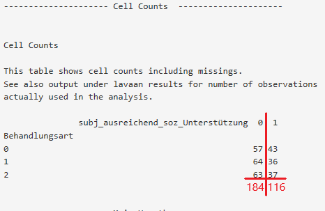
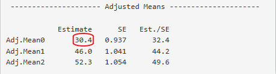

---
output:
  html_document: default
  pdf_document: default
---

```{r, echo=FALSE, include=FALSE}
library(knitr)
```

# Exkurs Adjustierte Mittelwerte{#exkadj}

Bei der bedingten linearen Regression macht das Verfahren der Mittelwertsbildung einen Unterschied für den Fall, dass das Design bezüglich der Kovariaten nicht vollständig balanciert ist. Wie adjustierte Mittelwerte von $\small Y$ für die verschiedenen Ausprägungen von $\small X$  gebildet werden wird im Folgenden an [Beispiel 5](#bspfünf) zu unserem Beispieldatensatz demonstriert *(Treatmentvariable: Behandlungsart ist* $\small 0$,$\small 1$ *oder* $\small 2$*, Kovariaten: Subjektiv ausreichend soziale Unterstützungist * $\small 0$ oder $\small 1$*)*.

Dem Output unter *Cell Counts* im Hauptoutput (siehe Figure \@ref(fig:exka1)) ist zu entnehmen, dass das Design im Beispiel unbalanciert ist: Unter der Bedingung $\small K=0$ liegen 116 Beobachtungen vor, unter der Bediungung $\small K=1$ liegen 184 Beobachtungen vor: 

```{r, exka1, echo=FALSE, fig.cap="Unbalanciertes Design",fig.align='center', out.width = '60%', warning=FALSE, message=FALSE, fig.pos="htbp"}

```

Zur Bildung der adjustierten Mittelwerte werden zuerst bedingte Erwartungswerte für alle Ausprägungen von $\small X$ unter allen Ausprägungen der Kovariaten gebildet. Diesen Schritt haben die Berechnung von Randmittelwerten und adjustierten Mittelwerten noch gemeinsam.  
Die bedingten Erwartungswerte werden zur Veranschaulichung für alle Zellen für die $\small X=0$ gilt berechnet (die bedingten Erwartungswerte unter der Bedingung $\small X=0$ werden nach dem selben Prinzip gebildet). Die Zahlenwerte für die Parameter g000 und g010 stammen aus der Analyse des Beispieldatensatzes für das Beispiel 5. Es ergeben sich:

\begin{align}
E(Y|X=0,K=1)&= g000 + g010 \notag\\  
&= 28,895 + 3,826\notag\\   
&= 32,721
(\#eq:exk1)
\end{align}

und
\begin{align}
E(Y|X=0,K=0)&= g000\\ 			       &= 28,895
(\#eq:exk2)
\end{align}

Der zweite Schritt bei der Bildung adjustierter Mittelwerte ist die bedingten Erwartungswerte für die Ausprägungen der Treatmentvariable zu Mitteln. Dabei werdein die bedingten Erwartungswerte an der proportionalen Häufigkeit der Beobachtung der Ausprägungen der Kovariate gewichtet.  
Zur Veranschaulichung wird der adjustierten Mitteslwert für die Bedingung $\small X=0$ aus den oben berechneten bedingten Erwartungswerten (Gleichungen \@ref(eq:exk1) und\@ref(eq:exk2)) und den Informationen zur Anzahl an Beobachtungen unter den Bedingugne $\small K=0$ und $\small K=1$ aus Figure \@ref(fig:exka1) berechnet:  

\begin{align}
Adj.Mean0 &= 32,721 \times \frac{116}{116+184} + 28,895 \times \frac{184}{116+184}\\
&= 30,374
(\#eq:exk3)
\end{align}

Bei der Berechnung von Randmittelwerten würde eine Gewichtung der bedingten Erwartungswerte ausbleiben, das Randmittel für die Bedingung $\small X=0$ wäre also $\frac{32,721+28,895}{2}$.  

Vergleiche den so berechneten adjustierten Mittelwert mit dem Output in der folgenden Abbildung:

```{r, exka2, echo=FALSE, fig.cap="Output Adjusted Means",fig.align='center', out.width = '60%', warning=FALSE, message=FALSE, fig.pos="htbp"}

```

Die durchschnittlichen Effekte, die EffectLiteR ausgibt, basieren auf adjustierten Mittelwerten. Der durchschnittliche Effekt von Treatment $\small X=1$ ist also $\small 46,0-30,4=15,6$ (die gerundeten Zahlen stammen aus dem Output für adjustierte Mittelwerte (Figure \@ref(fig:exka2)), EffectLiteR nutzt zur Berechnung der  adjustierten Effekte weniger stark gerundete Zahelnwerte). Haupteffekte, wie sie etwa von einer ANOVA geschätzt werden, basieren hingegen auf der Differenz der marginal Means.   
In der Verwendung adjustierter Mittelwerte liegt ein Vorteil der Analyse mit EffectLiteR gegenüber der Analyse mit einer ANOVA: Entspricht das Verhältnis der Anzahl der Beobachtungen unter den verschiedenen Ausprägungen der Kovariaten in etwa dem Verhältnis in der Population, so können mit den durchschnittlichen Effekten die Konsequenzen von Treatment-Maßnahmen auf die Gesamtpopulation besser abgeschätzt werden. 

**Beachte:** In nichtrandomisierten Studien, in denen evtl. Einflüsse der Kovariaten auf die Zuordnung zu den Treatmentbedingungen vorliegen (wenn sich z.B. vermehrt ältere Leute für die Treatmentbedingung zum Hörgeräte-Test und vermehrt jüngere Leute für die Kontrollbedingung melden und das Alter der Probanden Einflüsse auf die abhängige Variable aufweist), hat das hinzufügen konfundierter Kovariaten (in diesem Fall des Alters der Probanden) ebenfalls einen Einfluss auf die adjustierten Mittelwerte. Solche Kovariaten sollten unbedingt in die Regression aufgenommen werden, um fehlerhafte Effekt-Schätzungen zu vermeiden.
