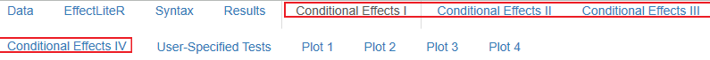

---
output:
  html_document: default
  pdf_document: default
---

```{r, echo=FALSE, include=FALSE}
library(knitr)
```

# Conditional Effects

Es gibt insgesamt vier Reiter im Output-Panel, die dabei helfen Bedingte Effekte unter verschiedenen Ausprägungen von Kovariaten zu interpretieren.

```{r, echo=FALSE, fig.cap="Vier Conditional-Effects-Reiter", out.width = '100%', warning=FALSE, message=FALSE, fig.pos="htbp"}

```

Diese vier Reiter werden nun einer nach dem anderen besprochen.

## Conditional Effects I

Unter Conditional Effects I werden für jeden Fall des Datensatzes alle beobachteten Prädiktoren aufgelistet und die Erwarteten Effekte unter diesen Bedingungen geschätzt.

```{r, CEI, echo=FALSE, fig.cap="Conditional Effects I - Output", out.width = '100%', warning=FALSE, message=FALSE, fig.pos="htbp"}
include_graphics("images/CEI1.png")
```

Der erste beobachtete Fall ist also in der Treatmentgruppe $\small X=2$, hat auf der kategorialen Kovariate $\small k1$ die Ausprägung $\small 0$ und auf der kontinuierlichen Kovariaten $\small z_1$ die Ausprägung $\small 0.576647$ ($\small K$ ist dann relevant, wenn mehrere kategoriale Kovariaten vorliegen und von EffectLiteR automatisch zu einer kategorialen Variablen $\small K$ zusammengefasst werden). Unter diesen Prädiktor-Ausprägungen liegt der Erwartungswert der Effektfunktion $\small g2(K)$ bei $\small -0.0555$ und der Standardfehler bei $\small 0.0869$. Der Erwartungswert der abhängigen Variablen liegt bei $\small ExpOutc2 = 0.0743$.  
Die Angaben zur Effektfunktion $\small g1(K)$ und dem Expected Outcome unter den Bedingungen $\small X=0$ (ExpOutc0) und $\small X=1$ (Exp.Outc1) sind mehr theoretischer Natur, da der erste angezeigte Fall nun mal der Treatmentgruppe $\small X=2$ zugeordnet ist.

## Conditional Effects II

Unter dem zweiten Conditional Effects Reiter hat man die Möglichkeit die Kombination aus Kovariatenausprägungen, unter der die bedingten Treatmenteffekte geschätzt werden, selbst auszuwählen. 
Wählt man für die kontinuierlichen Kovariaten den unter *Descriptive Statistics for Continous Covariates* angegebenen Mittelwert aus (in Figure \@ref(fig:CEII) beispielsweise $\small z_1=0.0036$), so erhält man als Effekt den Schätzer des durchschnittlichen bedingten Treatment-Effektes unter den gewählten Bedingungen der kategorialen Kovariaten (in Figure \@ref(fig:CEII) den Treatmenteffekt unter der Bedingung $\small k1=male$).
 
```{r, CEII, echo=FALSE, fig.cap="Conditional Effects II", out.width = '100%', warning=FALSE, message=FALSE, fig.pos="htbp"}
include_graphics("images/CEII1.png")
```

## Conditional Effects III

Dieser Reiter ist dann hilfreich, wenn Vorhersagen für einzelne Fälle getroffen werden sollen, für die nicht alle Daten vorhanden sind.  

Angenommen wir haben einen großen Datensatz mit vielen Kovariaten, der erfasst für welche Patienten welche Therapieform wie effektiv ist. Wir wollen entscheiden, ob für einen bestimmten Patienten Therapie $\small X=0$, Therapie $\small X=1$ oder Therapie $\small X=2$ am effektivsten zu sein scheint.  
Der uns vorliegende Datensatz sagt Therapieerfolg anhand der Kovariaten $\small k1$, $\small  kateg2$, $\small Z_1$, $\small Z_2$ und $\small Z_3$ vorher. Für den Patienten, für den wir die nach Möglichkeit erfolgreichste Therapie auswählen wollen, sind allerdings nur die Variablen für $\small k1$, $\small Z_1$ und $\small Z_3$ bekannt ($\small k1 = male$, $\small Z_1$ = 1.75, $\small Z_3$ = 1.75, siehe Figure \@ref(fig:CEIII)).  
Im Reiter *Conditional Effects III* können die drei bekannten Kovariaten eingegeben werden, während für die unbekannten Kovariaten ($\small kateg2$ und $\small Z_2$ ) $\small NA$ angegeben werden kann. EffectLiteR mittelt dann die Effekte der ähnlichsten Fälle um Effekte für den gewählten Einzelfall zu schätzen. 

```{r, CEIII, echo=FALSE, fig.cap="Conditional Effects III", out.width = '100%', warning=FALSE, message=FALSE, fig.pos="htbp"}
include_graphics("images/CEIII1.png")
```

Gehen wir davon aus, dass eine hohe Ausprägung der abhängigen Variablen wünschenswert ist, so sollten wir für den Patienten die Therapieform $\small X=0$ wählen, denn $\small ExpOutc0 > ExpOutc2 > ExpOutc1$. Die Angabe der Standardfehler der aggregierten Effekte hilft dabei abzuschätzen, inwieweit der Vergleich der ausgegebenen Erwartungswerte bei inferenzstatistischer Testung signifikant würde. Ein t-Test wird beispielsweise dann signifikant, wenn die Mittelwerts-Differenz größer als 1.96 Standardfehler (gemittelt über beide Gruppen) ist. 

Es ist hilfreich zu verstehen, wie die dem gewählten Fall „ähnlichen“ Fälle ermittelt werden, deren gemittelte Effekte als Schätzer für die gesuchten Effekte genutzt werden. Aus dem Datensatz werden Fälle herausgesucht, die die gleichen kategorialen Kovariaten-Ausprägungen haben, wie der Fall, auf den geschlussfolgert werden soll. Unser Patient ist männlich ($\small k1=0$), deshalb werden nur Daten von Männern betrachtet (siehe Kovariatenausprägungen unter $\small k1$ in Figure \@ref(fig:CEIII2).   
Für kontinuierliche Kovariaten muss die Betrachtung von Fällen mit ähnlichen Kovariaten-Ausprägungen ausreichen, da identische Ausprägungen in der Regel selten sind. Unser Patient hat die Kovariaten-Ausprägungen $\small z_1=1.75$ und $\small z_3=1.75$. Im Beispiel (Figure \@ref(fig:CEIII2)) wurden also die Fälle von Männern ausgesucht, die dem ausgewählten Fall auf den Variablen $\small Z_1$ und $\small Z_3$ am ähnlichsten sind, die Ausgewählten Fälle haben auf der Variable $\small Z_1$ Ausprägungen zwischen $\small 1,33$ und $\small 1,90$ und auf der Variable $\small Z_3$ Ausprägungen zwischen $\small 1,17$ und $\small 2,21$.  

```{r, CEIII2, echo=FALSE, fig.cap="Conditional Effects III - Ähnliche Fälle", out.width = '100%', warning=FALSE, message=FALSE, fig.pos="htbp"}
include_graphics("images/CEIII2.png")
```

Dass insgesamt 10 Fälle als ähnlich ausgewählt wurden, entspricht der Default-Einstellung, kann allerdings unter *Number of rows* frei ausgewählt werden. Wenn die Kovariaten-Ausprägungen der ausgewählten Fälle den Kovariaten-Ausprägungen des Falles, auf den geschlossen werden soll, stark ähneln, kann die Anzahl ausgewählter Fälle erhöht werden, weichen sie hingegen stark von den Kovariaten-Ausprägungen des Falles, auf den geschlossen werden soll, ab, sollte die Anzahl verringert werden.   

Die Auswahl der angegebenen Kovariaten sollte mit Bedacht geschehen. In unserem Beispiel betrachten wir einen männlichen Patienten. Da wir uns dazu entschieden das Geschleicht unter dem *Conditional Effects III*-Reiter anzugeben, werden nur Fälle anderer Männer in Betracht gezogen. Es ist also nur sinnvoll anzugeben, dass der Fall, auf den geschlossen werden soll, ein Mann ist, wenn das Geschlecht oder die Interaktion von Geschlecht und anderen Prädiktoren die abhängige Variable auch zu einem angemessenen Grad vorhersagen. Wenn das Geschlecht die abhängige Variable hingegen kaum vorhersagt, gibt man es besser nicht an, weil man damit die Zahl der Fälle, in denen nach ähnlichen Kovariaten-Ausprägungen gesucht wird, stark einschränkt. Das selbe Prinzip gilt auch für die Auswahl von kontinuierlichen Kovariaten.

## Conditional Effects IV

Der Reiter *Conditional Effects IV* kann dann verwendet werden, wenn lediglich eine einzige abhängige Variable bekannt ist. In diesem Reiter wird eine Regression der gewünschten Kovariate auf eine Effektfunktion geschätzt.

```{r, echo=FALSE, fig.cap="Conditional Effects III - Output", out.width = '100%', warning=FALSE, message=FALSE, fig.pos="htbp"}
include_graphics("images/CEIV1.png")
```

Der Output wird wie folgt interpretiert: Der geschätzte Effekt einer Veränderung von $\small X=0$ zu $\small X=1$ unter der Bedingung $\small k=k0$ ist $\small 3,288$, unter der Bedingung $\small k=k1$ ist der geschätzte Effekt $\small 1,409$ und unter der Bedingung $\small k=k2$ ist der geschätzte Effekt $\small -0,337$.  
Dir wird aufgefallen sein, dass unter *Conditional Effects IV* nicht von vornherein Standardfehler für die geschätzten Effekte berechnet werden. Zur formalen Berechnung von Standardfehlern müssen generell bestimmte Annahmen getroffen werden (beispielsweise ob der Zusammenhang zwischen Prädiktor und Regressand linear oder quadratisch ist, Annahmen über die Form der Verteilung, …). Für die Regression einer Kovariaten auf eine Effektfunktion sind solche Verteilungsannahmen nicht generell bekannt, deshalb wird von EffektLiteR kein Standardfehler geschätzt.   
Will man dennoch einen Standardfehler interpretieren kann man auf das Bootstrap-Verfahren zurückgreifen. Dabei werden auf Grundlage der Stichprobe verwandte Stichproben simuliert (durch zufälliges ziehen von Fällen „mit zurücklegen“, das heißt einige Fälle der Stichprobe werden gar nicht beachtet, andere Fälle mehrfach). Für jede simulierte Stichprobe wird die Regression der Kovariaten auf die Effektfunktion gerechnet, die Standardabweichung der so gefundenen Effektgrößenschätzer wird als Standardfehler interpretiert. Die Anzahl an Stichproben, die gezogen werden soll, kann der Nutzer unter *Number of bootstrap draws* frei angeben. Natürlich wird die Schätzung des Standardfehlers um so genauer, je mehr simulierte Stichproben gezogen werden, jedoch (*Vorsicht!*) dauert die Berechnung bei einer großen Zahl an Bootstraps auch entsprechend länger und kann nicht so einfach abgebrochen werden. 

