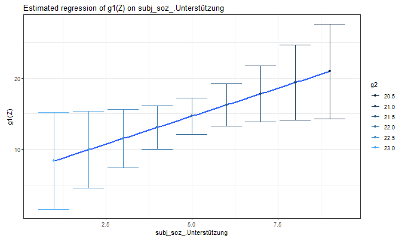

---
output:
  html_document: default
  pdf_document: default
---

```{r, echo=FALSE, include=FALSE}
library(knitr)
```

# Plots

EffectLiteR kann Graphiken erstellen, die die Übersichten über Zusammenhänge der gerechneten Regressionen verbessern. Hierfür gibt es vier verschiedene Reiter im Eingabepanel, die zur graphischen Verdeutlichung verschiedener Informationen gedacht sind.
 
```{r, echo=FALSE, fig.cap="Vier Plot-Reiter", out.width = '100%', warning=FALSE, message=FALSE, fig.pos="htbp"}
include_graphics("images/Plots1.png")
```

In diesem Kapitel werden diese vier Reiter einer nach dem anderen behandelt.

## Plot 1
Unter Plot 1 werden Histogramme mit Häufigkeiten aller Ausprägungen der abhängigen Variable für die untersuchten Zellen des Designs angezeigt (jede Ausprägungskombination der kategorialen Prädiktoren stellt eine Zelle dar).  
Solche Histogramme können beispielsweise als Hinweise dafür dienen, ob die abhängige Variable unter den verschiedenen Bedingungen normalverteilt ist, ob eine Schiefe in der Verteilung vorliegt oder ob es unter bestimmten Bedingungen Boden- oder Deckeneffekte gibt. 

```{r, echo=FALSE, fig.cap="Plot 1", out.width = '100%', warning=FALSE, message=FALSE, fig.pos="htbp"}
include_graphics("images/Plots2.png")
```

**Interpretation der Beispielgraphik** (dreistufige Treatment-Variable, keine kategorialen Kovariaten): In keiner der Zellen liegen Decken- oder Bodeneffekte vor. In allen drei Zellen scheint die abhängige Variable mehr oder weniger normalverteilt zu sein, in Zelle $\small 0$“ sieht die Normalverteilung minimal linksschief aus, was auf die Regression an sich keine großen Auswirkungen hat. Dass der Gipfel der Verteilung in Zelle $\small 2$ niedriger ist als in den anderen beiden Zellen, deutet auf einen Treatmenteffekt hin: Unter der Bedingung in Zelle $\small 2$ finden sich im Mittel weniger hohe Ausprägungen des Regressanden, als unter den anderen beiden Bedingungen.  

Betrachtet man eine Regression mit ausschließlich kontinuierlichen Kovariaten erhält man eine Zelle pro Ausprägung der Treatmentvariablen, betrachtet man Fälle mit ein oder mehreren kategorialen Variablen erhält man für jede Kombination von Treatmentvariablen- und kategorialen Kovariaten-Ausprägungen eine Zelle. Welche Zelle für welche Bedingung steht kann unter *Variables* im Hauptoutput nachgesehen werden. Es folgt ein Beispiel mit zwei kategorialen Kovariaten. In Figure \@ref(fig:plot1) ist nicht nur der Output unter *Plot 1* sondern zur Zuordnung der Zellen zu ihren Bedingungen auch der [*Variables*-Output](#zweivariables) angezeigt.

```{r, plot1, echo=FALSE, fig.cap="Plots 1 und Variables-Output in 3x2x2-Zellen-Design", out.width = '100%', warning=FALSE, message=FALSE, fig.pos="htbp"}
include_graphics("images/Plots3.png")
```

**Interpretation der Beispielgraphik**: Zelle $\small 12$ beschreibt die Bedingung $\small X = treat1$, $\small K = 2$. $\small K$ ist eine (von EffectLiteR) zusammengesetzte Kategorie: $\small K=2$ bedeutet $\small k1=female$ und $\small kateg2=1$. Die Verteilung für Zelle $\small 12$ zeigt also die Häufigkeitsverteilung der abhängigen Variable $\small dv$ für Frauen/Mädchen ($\small k1$) der Gruppe $\small treat1$ mit der Ausprägung $\small kateg2 = 2$.

## Plot 2{#plotzwei}
Plot 2 zeigt die Regressionsgerade einer kontinuierlichen Kovariaten $\small Z$ auf den Regressanden in jeder der Bereits unter Plot 1 beschriebenen Zellen. 

```{r, echo=FALSE, fig.cap="Plot 2 - Output", out.width = '100%', warning=FALSE, message=FALSE, fig.pos="htbp"}

```

Man kann erkennen, dass in Bereichen des Prädiktors, für die nur wenige Schätzwerte vorliegen (jeweils links und rechts außen) ein größerer bläulicher Schatten um die Regressionsgerade eingezeichnet ist, während dieser Schatten in Bereichen des Prädiktors, für die viele Schätzwerte vorliegen (jeweils in der Mitte) kleiner ist.
Dieser blaue Schatten stellt den Standardfehler der Regression unter bestimmten Ausprägungen des Prädiktors dar. Eine solche Schätzung des Standardfehlers gelingt unter Annahme der probabilistischen Testtheorie: Anders als die klassische Testtheorie, die für eine Regression nur einen einzigen Gesamt-Reliabilitäts-Kennwert vorsieht, berücksichtigt die probabilistische Testtheorie, dass eine Regression in Bereichen, in denen viele Beobachtungen von Prädiktor und Regressand vorliegen, zu genaueren Vorhersagen fähig ist, als in Bereichen, in denen nur wenige Beobachtungen vorliegen.

## Plot 3
Unter *Plot 3* lassen sich Zusammenhänge zwischen den Effekt-Funktionen und anderen Variablen verdeutlichen. Der Abschnitt zu Plot 3 geht Schritt für Schritt durch die im linken Plot-Panel vorhandenen Eingabeoptionen (siehe Graphik unten) ein und behandelt zum Schluss noch einige Zusammenhänge zwischen den anzeigbaren Graphiken und den von EffectLiteR geschätzten Regressionsparametern aus dem Hauptoutput.

```{r, echo=FALSE, fig.cap="Plot 3 - Input Möglichkeiten", out.width = '100%', warning=FALSE, message=FALSE, fig.pos="htbp"}

``` 

### Effect function und Regressor
Auf der linken Seite kann die gewünschte Effekt-Funktion eingegeben werden und der Regressor gewählt werden. Wird eine kontinuierliche Kovariate als Regressor gewählt, so zeigt der Plot die geschätzten Effekte für jede empirische Ausprägung der Kovariaten an, durch diese geschätzten Effekte kann EffectLiteR einen Graph legen. Plot 3 lässt sich auch mit kategorialen Kovariaten erstellen, in diesem Fall kann kein Graph angezeigt werden, es werden lediglich Punkte für die geschätzten Effekte unter der angegebenen Bedingung angezeigt.


```{r, echo=FALSE, fig.cap="Plot 3 - kategorialer vs. kontinuierlicher Regressor", out.width = '100%', warning=FALSE, message=FALSE, fig.pos="htbp"}
include_graphics("images/Plots6.png")
```

### Colour variable
Plot 3 erlaubt eine Colour-Variable festzulegen, durch die der Zusammenhang mit einer dritten Variablen visualisierbar ist. In Figure \@ref(fig:plot3color) wurde die Effektfunktion 2 als Colour-Variable gewählt: Es ist erkennbar, dass bei geringer sozialer Unterstützung nicht nur die Effektfunktion 1 eher kleinere Werte annimmt (siehe Y-Achse) sondern auch die Effektfunktion 2 eher höhere Werte annimmt (siehe Farbskala). 

```{r, plot3color, echo=FALSE, fig.cap="Plot 3 - Colour Variable",fig.align='center', out.width = '90%', warning=FALSE, message=FALSE, fig.pos="htbp"}

``` 

### Regression Line
Unter Regression Line kann eingestellt werden, ob eine lineare Funktionsgerade durch die Punkte gelegt werden soll (*linear*), ob gar keine Funktion dargestellt sondern lediglich die Mittelwerte für die verschiedenen empirisch gefundenen Ausprägungen der X-Achsen-Variable angezeigt werden sollen (*none*) oder ob eine nicht lineare Funktion mit optimiertem Fit angezeigt werden soll (*smooth*). Die Option *smooth* kann von der Option *linear* abweichen, wenn mehrere Kovariaten (Im Beispiel unten: eine kategoriale und eine kontinuierliche Kovariate) im Regressionsmodell vorhanden sind. Korrelieren die beiden Kovariaten miteinander oder ist das Design unbalanciert, kommt es je nach gewählter Option zu unterschieden in der geschätzten Regressionslinie.  
In Figure \@ref(fig:plot3regline) wurde die kontinuierliche Kovariate als Regressor eingestellt und *smooth* als Option gewählt.

```{r, plot3regline, echo=FALSE, fig.cap="Plot 3 - smoothe Regression Line",fig.align='center', out.width = '80%', warning=FALSE, message=FALSE, fig.pos="htbp"}
include_graphics("images/Plots8.png")
```

Dass im Screenshot die Kovariaten miteinander korrelieren, ist daran erkennbar, dass der Zusammenhang der kontinuierlichen Kovariate CPM21 auf die Effektfunktion unter den verschiedenen Bedingungen der kategorialen Kovariate verschieden ist (zwei der „Punktelinien“ verlaufen relativ parallel abwärts, die dritte „Punktelinie“ verläuft fast konstant).


### Confidence Intervals
Durch einen Klick auf *show CIs* werden die Konfidenzintervalle der geschätzten Effekte der verschiedenen empirisch gefundenen Ausprägungen der x-Achsen-Variable angezeigt. 
Durch einen Klick auf *Regression CI* wird das Konfidenzintervall der Regression selbst als blauer Schatten angezeigt. Wie bereits unter [Plot 2](#plotzwei) beschrieben, beruht eine solche Schätzung des Konfidenzintervalls auf der Annahme der probabilistischen Testtheorie: Anders als die klassische Testtheorie, die für eine Regression nur einen einzigen Gesamt-Reliabilitäts-Kennwert vorsieht, berücksichtigt die probabilistische Testtheorie, dass eine Regression in Bereichen, in denen viele Beobachtungen von Prädiktor und Regressand vorliegen, zu genaueren Vorhersagen fähig ist, als in Bereichen, in denen nur wenige Beobachtungen vorliegen.

### Zusammenhänge zwischen den Graphen des Plot 3 und den Regressionsparametern

#### Kontinuierliche Kovariate Z als Regressor
Am häufigsten wird Plot 3 vermutlich für den Zusammenhang einer kontinuierlichen Kovariaten mit einer Effektfunktion erstellt. Betrachten wir als Beispiel hierfür unseren Beispieldatensatz 2, rechnen eine bedingte lineare Regression von Behandlungsart (Treatmentvariable) und subjektiver sozialer Unterstützung (kontinuierliche Kovariate) auf den Gesundheitsscore und stellen als Effektfunktion g1 ein sowie als Regressor subjektive soziale Unterstützung.

```{r, echo=FALSE, fig.cap="Plot 3 - Beispiel mit kontinuierlicher Kovariate",fig.align='center', out.width = '90%', warning=FALSE, message=FALSE, fig.pos="htbp"}

```

Plot 3 skizziert eine Funktion mit dem Parameter g100 als Y-Achsenabschnitt dem Parameter g101 als Steigung.
g100 ist der geschätzte Effekt des Treatments 1 unter der Bedingung $\small Z_1=0$. g101 schätzt die Interaktion zwischen $\small Z_1$ und dem Effekt des Teatments 1; g110 schätzt um wie viel der Effekt von Treatment 1 steigt, wenn $\small Z_1$ um eine Einheit steigt.

#### Kategoriale Kovariate K als Regressor
Die Erkenntnisse aus dem letzten Abschnitt (Kontinuierliche Kovariate Z als Regressor) lassen sich auch auf kategoriale Kovariaten übertragen. Rechenen wir im Beispieldatensatz 2 eine Regression von Behandlungsart (Treatmentvariable) und subjektiv ausreichender sozialer Unterstützung (kategoriale Kovariate) auf den Gesundheitsscore (abhängige Variable) und stellen für Plot 3 als Effektfunktion g1 und als Regressor subjektiv ausreichend soziale Unterstützung ein, so erhalten wir folgenden Plot:
 
```{r, echo=FALSE, fig.cap="Plot 3 - Beispiel mit kategorialer Kovariate",fig.align='center', out.width = '90%', warning=FALSE, message=FALSE, fig.pos="htbp"}
include_graphics("images/Plots9.png")
```

Stellen wir uns eine Regressionsgerade vor, die die beiden Punkte $\small E(g1(K,Z)|K=0)$ und $\small E(g1(K,Z)|K=1)$ verbindet, so entspricht auch hier der Parameter g100 aus dem Hauptoutput dem Y-Achsenabschnitt (bzw. dem Punkt E(g1(K,Z)|K=0)). Die „Steigung“ entspricht der Differenz von $\small  E(g1(K,Z)|K=1)$ und $\small E(g1(K,Z)|K=1)$, und damit dem Parameter g110 aus dem Hauptoutput.

## Plot 4
Plot 4 dient ebenfalls dazu sich einen besseren Überblick über vorliegende Daten zu verschaffen. Man kann sich die einzelnen geschätzten Effekte für alle Fälle des geladenen Datensatzes plotten lassen und sie in Abhängigkeit einer anderen Variable einfärben.
Figure \@ref(fig:plot4bsp1) lässt zum Beispiel darauf schließen, dass höhere Ausprägungen der Kovariaten $\small Z_1$ mit eher niedrigeren Effekten der g2 Funktion einhergehen (man erkennt ein farbliches Gefälle zwischen oben und unten), die Graphik darunter \@ref(fig:plot4bsp2) lässt darauf schließen, dass es keinen ausgeprägten Zusammenhang zwischen der Kovariate $\small k1$ und den Effekten der g2 Funktion gibt.
 
```{r, plot4bsp1, echo=FALSE, fig.cap="Plot 4 - Beispiel 1", out.width = '100%', warning=FALSE, message=FALSE, fig.pos="htbp"}
include_graphics("images/Plots10.png")
```
  
```{r, plot4bsp2, echo=FALSE, fig.cap="Plot 4 - Beispiel 2", out.width = '100%', warning=FALSE, message=FALSE, fig.pos="htbp"}
include_graphics("images/Plots11.png")
```

## Übung "Plots" 
Lade den [Übungsdatensatz 2](../Datensätze/EffectLiteR_Tutorial_Übungsdatensatz2.csv), rechne eine bedingte lineare Regression mit Gesundheitsscore als Regressand und subjektiver sozialer Unterstützung als Prädiktor. Lasse dir von Plot 3 die Regression des Prädiktors auf eine der Effektfunktionen anzeigen.  

Wie verändert sich die Steigung der Regressionsgeraden, wenn du  anstatt einer bedingten linearen Regression eine zweifache lineare Regression rechnest (im Eingabepanel unter *Options* *No Interactions* auswählen)?
Mache dir am Vergleich der beiden Graphen klar, worin der Unterschied zwischen den beiden Regressionsmodellen besteht und erkläre, warum sich die Steigung verändert. 

Die Lösungen und ein Video zur Erklärung findest du [hier](#lösungen).

