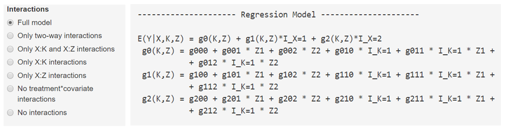

---
output:
  html_document: default
  pdf_document: default
---

```{r, echo=FALSE, include=FALSE}
library(knitr)
```

# Komplexerer Parametrisierungen  - Übungen{#komplex}

In diesem Kapitel werden aufeinander aufbauend Übungen zu immer komplexeren Regressions-Modellen präsentiert. Die Übungen sind theoretischer Natur: Durch komlexere Modelle steigen die Anforderungen an die Interpretation von Parametern und Effekten, die Anforderungen an die Bedienung von EffectLiteR steigen nicht. Die Lösungen zu den Aufgaben befinden sich weiter unten im Kapitel.

## Übungen

### Übung K1
Gegeben ist folgendes Regressionsmodell mit einer zweistufigen Treatmentvariablen $\small X$, und einer dreistufigen kategorialen Kovariaten $\small K$:

\begin{align}
E(Y|X,K) &= g0(K) + g1(K) \times I_{X=1}\\
g0(K) &= g000 + g010  \times I_{K=1} + g020  \times I_{K=2} \\
g1(K) &= g100 + g110  \times I_{K=1} + g120  \times I_{K=2}
\end{align}

Drücke die Parameter mit Erwartungswerten aus und interpretiere sie in Worten.

### Übung K2
Schreibe die Regressionsgleichung / das Regressionsmodell für den Fall einer dreistufigen Treatmentvariable $\small X$ und einer zweistufigen Treatmentvariable $\small K$ auf.

### Übung K3
Gegeben ist folgendes Regressionsmodell mit einer dreistufigen Treatmentvariablen $\small X$, und einer dreistufigen kategorialen Kovariaten $\small K$:

\begin{align}
E(Y|X,K) &= g0(K) + g1(K) \times I_{X=1} +  g2(K) \times I_{X=2}\\
g0(K) &= g000 + g010  \times I_{K=1} + g020  \times I_{K=2} \\
g1(K) &= g100 + g110  \times I_{K=1} + g120  \times I_{K=2}\\
g2(K) &= g200 + g210 \times I_{K=1}+ g220 \times I_{K=2}
\end{align}

Drücke die Parameter mit Erwartungswerten aus und interpretiere sie in Worten.

### Übung K4
Wenn mehrere kategoriale Variable (z.B. $\small K_1$ -weiblich vs. männlich- und $\small K_2$ -Kategorie 2(EG) vs. Kategorie 1(KG)) als Prädiktoren ausgewählt wurden, so kombiniert EffectLiteR diese zu einem gemeinsamen kategorialen Prädiktor. Auf diese Art und Weise kreiert EffectLiteR für das genannte Beispiel eine vierstufige Kovariate K mit den Ausprägungen:

* K=0 männlich-EG,
* K=1 männlich-KG,
* K=2 weiblich-EG,
* K=3 weiblich-KG 

Durch diese Parametrisierung kommt es nicht zur Berechnung von Interaktionen der kategorialen Prädiktoren untereinander.
Stelle das entsprechende Regressionsmodell auf und interpretiere seine Parameter inhaltlich (in Worten und Erwartungswerten).

### Übung K5
Auch bei  mehreren kontinuierlichen Kovariaten wird die Interaktion der Kovariaten nicht zur Aufklärung von Varianz im Prädiktor hinzugezogen. Bei einer zweistufigen Treatmentvariablen und zwei kontinuierlichen Kovariaten wird folgendes Regressionsmodell geschätzt:

\begin{align}
E(Y|X,Z_1,Z_2)&= g0(Z_1,Z_2) + g0(Z_1,Z_2) \times I_{X=1}\\
g0(Z_1,Z_2)&= g000 + g001 \times Z_1 +  g002 \times Z_2\\
g1(Z_1,Z_2)&= g100 + g101 \times Z_1 +  g102 \times Z_2
\end{align}

Angenommen die abhängige Variable steht für einen Gesundheitsscore von Patienten, die Treatmentvariable steht für die Behandlung der Patienten ($\small X=1$) vs. keine Behandlung ($\small X=0$), die Kovariate $\small Z_1$ steht für das Alter der Patienten und die Kovariate $\small Z_2$ für die subjektiv empfundene soziale Unterstützung. Beide Kovariaten wurden z-standardisiert. Drücke die Parameter des Regressionsmodells mit Erwartungswerten aus und interpretiere sie inhaltlich.

### Übung K6
Nur wenn sowohl kontinuierliche als auch kategoriale Prädiktoren in das Modell aufgenommen werden, werden Interaktionen zwischen der aggregierten Kategorienvariable $\small K$ und den verschiedenen kontinuierlichen Variablen geschätzt. In diesem Fall kann unter *Interactions* im Eingabe-Panel recht genau eingestellt werden, welche Interaktionen geschätzt werden sollen und welche nicht.  
Generell gilt: Je weniger „unnötige“ Parameter geschätzt werden, desto genauer können die tatsächlich relevanten Parameter geschätzt werden. Deshalb ist sinnvoll nur inhaltlich plausible Interaktionen in seinem Modell zu belassen.  
In der Abbildung unten (Figure \@ref(fig:uebungk6)) siehst du ein Modell mit zwei kontinuierlichen und einer kategorialen Kovariaten, außerdem die möglichen Einstellungen zur Begrenzung des Modells unter *Interactions* im Eingabepanel.
Überlege welche Parameter unter den verschiedenen möglichen Restriktionen nicht geschätzt würden (Welche Parameter würden unter der Einstellung *Only two way interactions* nicht geschätzt, welche unter der Einstellung *only X:K and X:Z interactions*,...).
 
```{r, uebungk6, echo=FALSE, fig.cap="Übung komplexes Modell 6.png", out.width = '100%', warning=FALSE, message=FALSE, fig.pos="htbp"}

```


## Lösungen{#lösungenk}

*Bemerke: Für Übung K1 ist ein detaillierter Lösungsweg abgebildet, während für die verwandten Übungen K3-K5 ledigliche die Ergebnisse vorliegen. Gehe zur Lösung der Übungen K3-K5 genau so vor, wie zur Lösung der Aufgabe K1.*

### Lösung K1

Schritt1) X und K auf null setzen:  
\begin{align}
E(Y|X=0,K=0) &= g_{000} + g_{010} \times 0+ g_{020} \times 0+  (g_{100} + g_{110}  \times 0 + g_{120}  \times 0) \times 0\\ 
&= g_{000}
\end{align}

g000 gibt den Erwartungswert unter der Bedingung X=0, K=0 an.   

Schritt 2) X auf null und K auf eins setzen, dann Erwartungswert für g000 einsetzen:   

\begin{align}
E(Y|X=0,K=1) &= g_{000} + g_{010} \times 1+ g_{020} \times 0+  (g_{100} + g_{110}  \times 1 + g_{120}  \times 0) \times 0\\ 
&= g_{000} + g_{010}\\
&= E(Y|X=0,K=0) + g_{010}\\
g_{010} &=E(Y|X=0,K=1)-E(Y|X=0,K=0)
\end{align}

g010 gibt den Effekt einer Veränderung der Kovariaten von 0 zu 1 unter der Bedingung X=0 an.   

Schritt 3) X auf null und K auf zwei setzen, dann Erwartungswert für g000 einsetzen:  
\begin{align}
E(Y|X=0,K=2) &= g_{000} + g_{010} \times 0+ g_{020} \times 1+  (g_{100} + g_{110}  \times 0 + g_{120}  \times 1) \times 0\\ 
&= g_{000} + g_{020}\\
&= E(Y|X=0,K=0) + g_{020}\\
g_{020} &=E(Y|X=0,K=2)-E(Y|X=0,K=0)
\end{align}

g020 gibt den Effekt einer Veränderung der Kovariaten von 0 zu 1 unter der Bedingung X=0 an.  

Schritt 4) X auf eins und K auf null setzen, dann Erwartungswert für g000 einsetzen:   
\begin{align}
E(Y|X=1,K=0) &= g_{000} + g_{010} \times 0+ g_{020} \times 0+  (g_{100} + g_{110}  \times 0 + g_{120}  \times 0) \times 1\\ &= g000 + g100\\
&= E(Y|X=0,K=0) + g_{100}\\
g_{100} &=E(Y|X=1,K=0)-E(Y|X=0,K=0)
\end{align}

g100 gibt den Effekt des Treatments (X=1 vs X=0) unter der Bedingung K=0 an.  

Schritt 5)  X auf eins und K auf eins setzen, dann Erwartungswerte für g000, g010 und g100 einsetzen, dann kürzen:  

\begin{align}
E(Y|X=1,K=1) &= g_{000} + g_{010} \times 1+ g_{020} \times 0+  (g_{100} + g_{110}  \times 1 + g_{120}  \times 0) \times 1\\ 
&= g_{000} + g_{010} + g_{100} + g_{110}\\
&= E(Y|X=0,K=0) + [E(Y|X=0,K=1)-E(Y|X=0,K=0)] +\\ &+[E(Y|X=1,K=0)-E(Y|X=0,K=0)] + g_{110} \\
&=E(Y|X=0,K=1) + [E(Y|X=1,K=0)-E(Y|X=0,K=0)] + g_{110}\\
g_{110}&=[E(Y|X=1,K=1) - [E(Y|X=0,K=1)] – \\
&-[E(Y|X=1,K=0)-E(Y|X=0,K=0)]
\end{align}

g110 ist die Differnz des Treatmenteffektes unter der Bedingung K=1 und unter der Bedingung K=0, damit stellt er die Interaktion zwischen  X und K=1 versus K=0 dar.  

Schritt 6)  X auf eins und K auf zwei setzen, dann Erwartungswerte für g000, g010 und g100 einsetzen, dann kürzen:   

\begin{align}
E(Y|X=2,K=1) &= g_{000} + g_{010} \times 0+ g_{020} \times 1+  (g_{100} + g_{110}  \times 0 + g_{120}  \times 1) \times 1\\ 
&= g_{000} + g_{020} + g_{110} + g_{120}\\
&= E(Y|X=0,K=0) + [E(Y|X=0,K=2)-E(Y|X=0,K=0)] +\\ &+[E(Y|X=1,K=0)-E(Y|X=0,K=0)] + g_{120} \\
&=E(Y|X=0,K=2) + [E(Y|X=1,K=0)-E(Y|X=0,K=0)] + g_{120}\\
g_{120}&=[E(Y|X=1,K=2) - [E(Y|X=0,K=2)] –\\ &-[E(Y|X=1,K=0)-E(Y|X=0,K=0)]
\end{align}

g120 ist die Differnz des Treatmenteffektes von X unter der Bedingung K=2 und unter der Bedingung K=0, damit stellt er die Interaktion zwischen  X und K=2 versus K=0 dar.

### Lösung K2

\begin{align}
E(Y|X,K) &= g0(K) + g1(K) \times I_{X=1}\\
g0(K) &= g_{000} + g_{010}  \times I_{K=1}  \\
g1(K) &= g_{100} + g_{110}  \times I_{K=1} \\
g2(K) &= g_{200} + g_{210}  \times I_{K=1}
\end{align}

### Lösung K3

|Ewartungswert|Interpreation in Worten|
|-------------|-----------------------|
|$\small g_{000}=E(Y|X=0,K=0)$| g000 gibt den Erwartungswert unter der Bedingung X=0, K=0 an.|
|$\small g_{010} =E(Y|X=0,K=1)-E(Y|X=0,K=0)$| g010 gibt den Effekt einer Veränderung der Kovariaten von 0 zu 1 unter der Bedingung X=0 an.|
|$\small g_{020} =E(Y|X=0,K=2)-E(Y|X=0,K=0)$| g020 gibt den Effekt einer Veränderung der Kovariaten von 0 zu 2 unter der Bedingung X=0 an|
|$\small g_{100} =E(Y|X=1,K=0)-E(Y|X=0,K=0)$| g100 gibt den Effekt des Treatments (X=1 vs X=0) unter der Bedingung K=0 an.|
|$\small g_{110}=[E(Y|X=1,K=1) - [E(Y|X=0,K=1)]-\\ \small – [E(Y|X=1,K=0)-E(Y|X=0,K=0)]$|g110 ist die Differnz des Treatmenteffektes unter der Bedingung K=1 und unter der Bedingung K=0, damit stellt er die Interaktion zwischen  X und K=1 versus K=0 dar.|
|$\small g_{120} =[E(Y|X=1,K=2) - [E(Y|X=0,K=2)] –\\ \small-[E(Y|X=1,K=0)-E(Y|X=0,K=0)]$|g120 ist die Differnz des Treatmenteffektes von X unter der Bedingung K=2 und unter der Bedingung K=0, damit stellt er die Interaktion zwischen  X und K=2 versus K=0 dar.|
|$\small g_{200} =E(Y|X=2,K=0)-E(Y|X=0,K=0)$|g200 gibt den Effekt des Treatments (X=2 vs X=0) unter der Bedingung K=0 an.|
|$\small g_{210} =[E(Y|X=2,K=1) - [E(Y|X=0,K=1)] –\\ \small-[E(Y|X=2,K=0)-E(Y|X=0,K=0)]$|g210 ist die Differnz des Treatmenteffektes (X=2 vs X=0) unter der Bedingung K=1 und unter der Bedingung K=0, damit stellt er die Interaktion zwischen  X=2 vs X=0 und K=1 versus K=0 dar.|
$\small g220=[E(Y|X=2,K=2) - [E(Y|X=0,K=2)] –\\ \small -[E(Y|X=2,K=0)-E(Y|X=0,K=0)]$|g220 ist die Differnz des Treatmenteffektes von X (X=2 vs X=0) unter der Bedingung K=2 und unter der Bedingung K=0, damit stellt er die Interaktion zwischen  X=2 vs X=0 und K=2 versus K=0 dar.

### Lösung K4

Regressionsmodell:

\begin{align}
E(Y|X,K) &= g0(K) + g1(K) \times I_{X=1}\\
g0(K)&=g_{000} + g_{010} \times I_{K=1} + g_{020} \times I_{K=2} + g_{030} \times I_{K=3} \\
g1(K)&=g_{100} + g_{110} \times I_{K=1} + g_{120} \times I_{K=2} + g_{130} \times I_{K=3}
\end{align}

|Ewartungswert|Interpreation in Worten|
|-------------|-----------------------|
$\small g_{000} = E(Y|X=0,K=0)$|g000 gibt den Erwartungswert unter der Bedingung X=0 für Männer der Kategorie 1 an.
$\small g_{010} = E(Y|X=0,K=1)-E(Y|X=0,K=0)$|g010 gibt den Effekt der Kovariatenausprägung K=1 vs K=0 unter der Bedingung X=0 an: Um wie viel steigert sich der Erwartungswert von Y, wenn statt Männern der Kategorie eins (K=0) Frauen der Kategorie eins (K=1) betrachtet werden.
$\small g_{020} = E(Y|X=0,K=2)-E(Y|X=0,K=0)$|g020 gibt den Effekt der Kovariatenausprägung K=2 vs K=0 unter der Bedingung X=0 an: Um wie viel steigert sich der Erwartungswert von Y, wenn statt Männern der Kategorie eins (K=0) Männer der Kategorie zwei (K=2) betrachtet werden.
$\small g_{030} = E(Y|X=0,K=3)-E(Y|X=0,K=0)$|g030 gibt den Effekt der Kovariatenausprägung K=3 vs K=0 unter der Bedingung X=0 an: Um wie viel steigert sich der Erwartungswert von Y, wenn statt Männern der Kategorie eins (K=0) Frauen der Kategorie zwei (K=3) betrachtet werden.
$\small g_{100} = E(Y|X=1,K=0)-E(Y|X=0,K=0)$|g100 gibt den Treatmenteffekt für Männer der Kategorie 1 an.
$\small g_{110}=[E(Y|X=1,K=1)  - E(Y|X=0,K=1)] –\\ \small - [E(Y|X=1,K=0)-E(Y|X=0,K=0)]$|g110 gibt die Interaktion zwischen der Betrachtung von Männern der Kategorie zwei (K=0) vs. der Betrachtung von Frauen der Kategorie eins (K=1) und dem Treatment an: Um wie viel effektiver ist das Treatment bei Frauen der Kategorie 1 (K=1) als bei Männern der Kategorie 1 (K=0).
$\small g_{120}=[E(Y|X=1,K=2)  - E(Y|X=0,K=2)] –\\ \small - [E(Y|X=1,K=0)-E(Y|X=0,K=0)]$|g120 gibt die Interaktion zwischen der Betrachtung von Männern der Kategorie zwei (K=2) vs. der Betrachtung von Männern der Kategorie eins (K=1) und dem Treatment an: Um wie viel effektiver ist das Treatment bei Männern der Kategorie 2 (K=2) als bei Männern der Kategorie 1 (K=0).
$\small g_{130}=[E(Y|X=1,K=3)  - E(Y|X=0,K=3)] –\\ \small - [E(Y|X=1,K=0)-E(Y|X=0,K=0)]$|g130 gibt die Interaktion zwischen der Betrachtung von Frauen der Kategorie zwei (K=3) vs. der Betrachtung von Männern der Kategorie eins (K=0) und dem Treatment an: Um wie viel effektiver ist das Treatment bei Frauen der Kategorie 2 (K=3) als bei Männern der Kategorie 1 (K=0).


*Bemerke:* Hier bestimmt die Kodierung der Kovariate, welche Vergleiche geschätzt werden: K=0 ist die „Referenz-Kovariaten-Ausprägung“, ein Vergleich der Kovariaten-Ausprägungen K=1 vs K=2 wird beispielsweise nicht geschätzt. Es ist nicht möglich die „Referenz-Kovariaten-Ausprägung“ zu verändern, hier muss also von Anfang an mit einer sinnvollen Kodierung gestartet werden.


### Lösung K5

|Ewartungswert|Interpreation in Worten|
|-------------|-----------------------|
$\small g000 = E(Y|X=0, Z_1=\bar{z}_1=0,  Z_2=\bar{z}_2=0)$|g000 zeigt den erwarteten Gesundheitsscore von Patienten in durchschnittlichem Alter mit durchschnittlich ausgeprägter sozialer Unterstützung, die keine Behandlung erhalten, an.
$\small g001 = E(Y|X=0, Z_1=\bar{z}_1+1\times SD_{Z1}=1,  Z_2=\bar{z}_2=0)-\\ \small -E(Y|X=0, Z_1=\bar{z}_1=0,  Z_2=\bar{z}_2=0)$|g010 schätzt den Einfluss der Kovariaten $Z_1$ in der Kontrollgruppe: Wie viel  größer ist der Gesundheitsscore von Patienten ohne Behandlung, die eine Standardabweichung älter sind als das Mittel, im Vergleich zu durchschnittlich alten Patienten ohne Behandlung.
$\small g002 = E(Y|X=0, Z_1=\bar{z}_1=0,  Z_2=\bar{z}_2+1\times SD_{Z1}=1)-\\ \small -E(Y|X=0, Z_1=\bar{z}_1=0,  Z_2=\bar{z}_2=0)$|g002 schätzt den Einfluss der Kovariaten $Z_2$ in der Kontrollgruppe: Wie viel  größer ist der Gesundheitsscore von Patienten ohne Behandlung, die subjektiv  bewertet um eine Standardabweichung höhere soziale Unterstützung erfahren als das Mittel, im Vergleich zu Patienten mit subjektiv gemessen durchschnittlicher sozialer Unterstützung ohne Behandlung.
$\small g100 = E(Y|X=1, Z_1=\bar{z}_1=0,  Z_2=\bar{z}_2=0)-\\ \small -E(Y|X=0, Z_1=\bar{z}_1=0,  Z_2=\bar{z}_2=0)$|g100 gibt den durchschnittlichen Treatmenteffekt an, das heißt die geschätzte Differenz zwischen durchschnittlich alten und subjektiv durchschnittlich sozial unterstützten Patienten mit und ohne Behandlung.
$\small g101=[E(Y|X=1,Z_1=\bar{z}_1+1\times SD_{Z1}=1,  Z_2=\bar{z}_2=0)  -\\ \small -E(Y|X=0,Z_1=\bar{z}_1+1\times SD_{Z1}=1,  Z_2=\bar{z}_2=0)] –\\ \small  [E(Y|X=1,Z_1=\bar{z}_1=0,  Z_2=\bar{z}_2=0)-\\ \small -E(Y|X=0,Z_1=\bar{z}_1=0,  Z_2=\bar{z}_2=0)]$|g101 schätzt den Einfluss der Interaktion zwischen Treatment und Alter auf den Gesundheitsscore: Wie viel größer ist der Effekt des Treatments bei Patienten die eine Standardabweichung älter sind als der Durchschnitt, als bei durchschnittlich alten Patienten.
$\small g102=[E(Y|X=1,Z_1=\bar{z}_1=0,  Z_2=\bar{z}_2+1\times SD_{Z2}=1)  -\\ \small -E(Y|X=0,Z_1=\bar{z}_1=0,  Z_2=\bar{z}_2+1\times SD_{Z2}=1)] –\\ \small -[E(Y|X=1,Z_1=\bar{z}_1=0,  Z_2=\bar{z}_2=0)-\\ \small -E(Y|X=0,Z_1=\bar{z}_1=0,  Z_2=\bar{z}_2=0)]$|g102 schätzt den Einfluss der Interaktion zwischen Treatment und subjektiver sozialer Unterstützung auf den Gesundheitsscore: Wie viel größer ist der Effekt des Treatments bei Patienten die subjektiv gemessen eine Standardabweichung höhere soziale Unterstützung erfahren als der Durchschnitt, als bei subjektiv durchschnittlich sozial unterstützten Patienten.

### Lösung K6
|Restriktion|auf Null fixierte Parameter|
|:-------------------------|:-------------------------|
|Only two-way interactions|g111, g112,<br>g211, g212|
|Only X:K and X:Z interactions|g011, g012,<br>g111, g112,<br>g211, g212|
|Only X:K interactions| g101, g102, g111, g112,<br>g201, g202, g211, g212|
|Only X:Z interactions|g110, g111, g112,<br>g210, g211, g212,|
|No treatment*covariate interactions|g101, g102, g110, g111, g112,<br>g201, g202, g210, g211, g212|
|No interactions|g011, g012,<br>g101, g102, g110, g111, g112,<br>g201, g202, g210, g211, g212|
